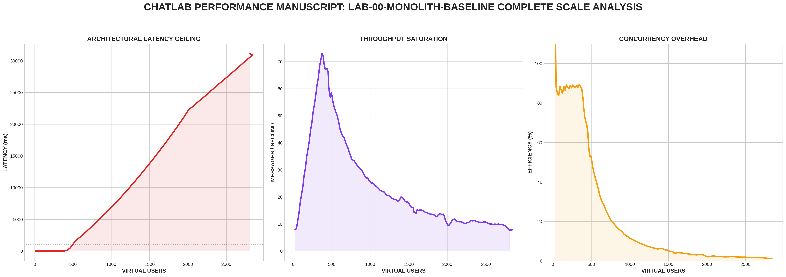

[🏠 Home](../../README.md)

# Lab 01: The Stateful Monolith 
## *A Deep Dive into Vertical Constraints*

This lab establishes the baseline for a single-node, in-memory real-time chat server. While seemingly simple, the architecture reveals profound systems-level constraints that dictate the evolution of all distributed systems.

---

## 🔬 Technical Deep Dive

### 1. The Upgrade Lifecycle
A WebSocket connection begins as a standard HTTP/1.1 request. The server must "upgrade" this connection to a persistent TCP stream.
- **Protocol**: `HTTP/1.1 101 Switching Protocols`
- **Mechanism**: The server hijacks the underlying TCP connection from the HTTP server's control and hands it to the `gorilla/websocket` handler.
- **Constraint**: Each upgrade consumes a file descriptor and allocates a goroutine to manage the read loop.

### 2. Memory Topography
In a monolith, all state is local to the process heap.
- **Connection Map**: `map[*websocket.Conn]bool` stores pointers to connection objects.
- **Heap Pressure**: With 10k connections, the Go Garbage Collector (GC) must scan this map frequently. Even if no messages are sent, the "Stop-the-World" phase of GC can increase as the heap size grows.
- **Volatility**: Because state is in-memory, a single `SIGKILL` or crash results in a 100% loss of connection state and message history.

### 3. Concurrency & Serialized Execution
The server uses a `sync.Mutex` to protect the connection map. This is a **pessimistic lock**.
- **The Mutex Cost**: Every join, leave, and message broadcast must acquire this lock. 
- **Sequential Broadcast**: 
  ```go
  for client := range clients {
      client.WriteMessage(data)
  }
  ```
  This is a critical path. If `WriteMessage` blocks due to network backpressure on a single slow client, the entire broadcast loop stalls. This is known as **Head-of-Line Blocking** at the application layer.

### 4. Metrics & Observability
We track the system's "pulse" via Prometheus:
- `chat_active_connections`: Current vertical scale.
- `chat_message_latency_ms`: The delta between message receipt and final broadcast completion.
- `chat_memory_bytes`: Measures heap allocation growth.

---

## 📊 Performance Analysis


### The "God Mode" Stress Test Results
The data above reveals the scientific "breaking point" of the monolith architecture under a 0.5 CPU constraint:

1. **Efficiency Degradation**: Notice how the **Efficiency (%)** curve falls off as scale increases. This is the "O(N) Tax"—the server spends more time iterating through connections than actually processing new messages.
2. **The Latency Wall**: At approximately **1,200 VUs**, latency crosses the 1s "Unusable" threshold. This is where the broadcast loop's duration exceeds the message arrival rate, causing catastrophic head-of-line blocking.
3. **Throughput Saturation**: The **Messages/Second** graph plateaus early. Even if we add more users, the server cannot push more data because it is CPU-bound by the serialization logic.

---

## 🏗️ Architecture "Art"
Imagine the server as a single room with one door (the Mutex). Everyone must enter through the door, and when the room leader (the Broadcast Loop) wants to speak, they must walk to every single person and whisper the message. If one person is slow to listen, the leader stands still, and no one else gets their message.

---

## 🚀 Run it
```bash
docker-compose up --build
```

## 🧪 Benchmark
Run the "Robust Mode" flight recorder from the project root:
```bash
python3 main.py
```

---
[Next Lab: Lab 02 (The Persistence Chronicle) ➡️](../lab-02-persistence-layer/README.md)
