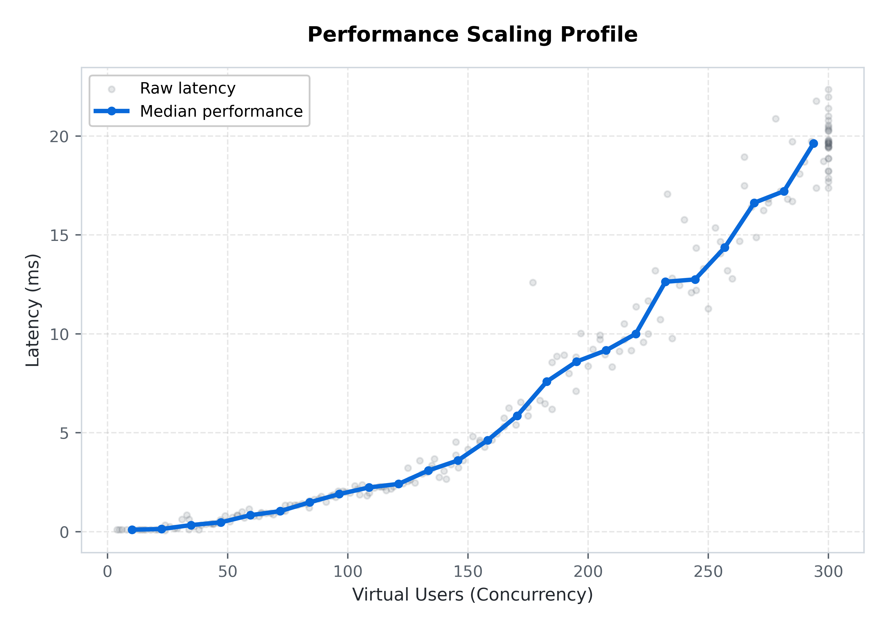

[🏠 Home](../../README.md) | [Next Lab (Lab 02) ➡️](../lab-02-persistence-layer/README.md)

# Lab 01: The Monolith Baseline
## *The In-Memory Monolith and the Efficiency Cliff*

### 🔴 The Problem
As real-time systems scale, they encounter **Stateful Bottlenecks**. In a naive monolith, user connections, room state, and message history are all stored in the server's local RAM. 
- **Fatal Flaw**: If the server restarts, all data is lost.
- **Scaling Limit**: Since state is local, you cannot add a second server (Server B wouldn't know about Server A's users).
- **Concurrency Tax**: High-concurrency leads to massive "Lock Contention" on shared memory structures.

### 🟢 The Approach
We begin by building a **Baseline Monolith**. This is a single-process Go server that handles WebSockets and message broadcasting in-process. This lab serves as our "Control Group" for all future benchmarking—it shows us the absolute maximum speed of a system before we introduce the complexity (and latency) of distributed databases and networks.

---

### 🏗️ Architecture
The system is a pure, single-process entity. No external databases, no caches, just Go.


*Figure 1: High-level architectural view of the Stateful Monolith.*

### 💻 Implementation
- **Language**: Go 1.21+
- **Concurrency**: Goroutines for each connection.
- **State Management**: `sync.RWMutex` protecting global maps.
- **Communication**: Fan-out broadcast loop within the websocket handler.

---

### 📊 Performance Analysis

*Figure 2: Unified view of Latency, Load, Throughput, and Resource Utilization.*

#### Analysis:
1. **The Concurrency Wall**: Despite sub-5ms latency at low load, the server hits a "Cliff" where latency spikes exponentially. This is the **Mutex Contention** in action—too many threads fighting for the same memory lock.
2. **The "Silent Failure" Paradox**: 
   
   *Figure 3: The Throughput Deficit shows massive loss, yet the 'Dropped Total' counter is 0.*
   
   **Why are drops reported as 0?**  
   In this baseline monolith, we have no internal queues or rate limiters. When the server saturates, messages don't get "dropped" by the application; they are **ignored by the saturated TCP stack** or blocked by the Go runtime's scheduler. Because the application-level logic never even sees these messages, the `dropped_total` Prometheus counter never increments. This is a **Silent Failure**.

3. **Latency Scaling Profile**:
   
   *Figure 4: Median latency response isolating the impact of concurrency (VUs) on system speed.*

---

### 🔬 Key Lessons
- **Locks are Expensive**: Even the fastest Go code is limited by shared state synchronization.
- **Speed != Scale**: A system can be extremely fast (low latency) but fail to scale (handle high concurrency).
- **The Need for External State**: To grow beyond this, we must move state out of the process and into a persistent layer (Lab 02).

---

### 🚀 Commands
**Start the Lab:**
```bash
cd labs/lab-01-monolith-baseline
docker-compose up --build -d
```

**Run Automated Benchmark:**
```bash
python3 labs/lab-01-monolith-baseline/benchmark/run.py
```

**Generate Modern Graphs:**
```bash
python3 labs/lab-01-monolith-baseline/benchmark/plot.py
```

---

### 📂 Folder Structure
- `services/chat-server/`: The core Go application.
  - `main.go`: Monolithic logic (Websockets, Broadcast, State).
  - `static/`: The frontend UI for manual testing.
- `benchmark/`: K6 scripts and Python analytics.
  - `run.py`: The automated benchmark orchestrator.
  - `plot.py`: The GitHub-Modern visualization engine.
- `assets/benchmarks/`: Permanent storage for performance graphs.
- `docker-compose.yml`: Infrastructure-as-Code for the baseline.

---
[Next Lab: Lab 02 (Persistence Layer) ➡️](../lab-02-persistence-layer/README.md)
