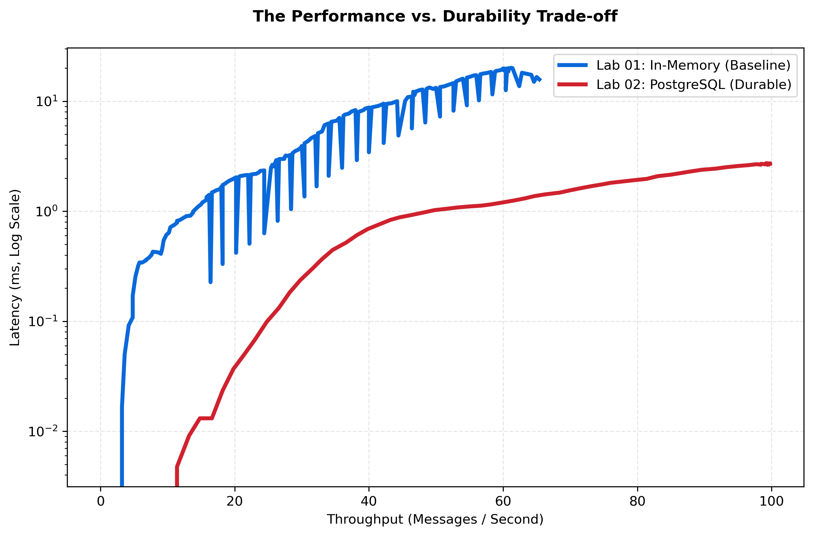

[🏠 Home](../../README.md) | [Next Lab (Lab 02) ➡️](../lab-02-persistence-layer/README.md)

# Lab 01: The Monolith Baseline
## *Pure Real-Time (Low Latency, Zero Durability)*

### 🎯 Objective
This lab establishes the baseline behavior of the chat system when everything happens inside one Go process and all state lives in memory. The goal is to measure the best-case latency profile of a single-node monolith, then make its architectural limits visible before we introduce durability in later labs.

### 🧩 Problem Statement
The fastest possible version of the system is not automatically the most useful one. Lab 01 solves the "what is our starting point?" problem by intentionally using a minimal architecture so we can observe the raw benefits of in-memory state and the hard limitations that come with volatile storage and a single shared lock.

### 🏛️ System Architecture (Structured View)
```text
Client
  -> WebSocket connection on /ws
  -> Chat server (single Go process)
     -> in-memory client registry: map[*websocket.Conn]bool
     -> synchronized broadcast path: sync.Mutex
     -> Prometheus metrics on /metrics
  -> broadcast response to all connected clients
```

### 📌 Assumptions
- Single node only; there is no clustering or horizontal scaling.
- No persistence layer; all messages and connection state are process-local.
- Benchmarks run on a local developer machine using Docker Compose and localhost networking.
- Failure handling is intentionally minimal; process restarts are treated as total state loss.
- Latency values in this README come from the benchmark sampler's 1-second Prometheus snapshots, which are good for trend analysis but are not raw packet-level timings.

### 🧠 Key Terms
- **Latency**: Time from message handling to broadcast observation, expressed in milliseconds.
- **Throughput**: Messages processed or broadcast per second.
- **Persistence**: Whether messages survive process restarts.
- **Durability**: Stronger form of persistence; acknowledged data is expected to remain available after faults.
- **Tail latency**: Higher-end latency percentiles such as p90 and p99 that reveal worst-case user experience.
- **Volatile state**: Data held only in RAM and lost when the process exits.

### 🔄 Step-by-Step Request Flow
1. A client opens a WebSocket connection to `/ws`.
2. The server upgrades the request and stores the connection in the in-memory `clients` map.
3. The client sends a JSON chat message containing `user_id`, `room_id`, `content`, and a client-side `trace_id`.
4. The server unmarshals the message, stamps `timestamp` and `node_id`, and enters the `broadcast()` path.
5. `broadcast()` acquires the global mutex, serializes the payload once, and writes it to every connected client.
6. Prometheus counters and latency histograms are updated.
7. Connected clients receive the broadcast and k6 records observed message latency from the embedded server timestamp.

### 🔬 The Hypothesis
> "A single-process, in-memory architecture will provide the absolute minimum latency floor (sub-1ms), but will be fundamentally non-durable and limited by single-node lock contention."

### 🔴 The Problem: Volatile State
In this baseline, user connections and room state are stored entirely in the server's local RAM. 
- **The Risk**: Any server restart results in **100% Data Loss**.
- **The Scaling Limit**: Since state is local, horizontal scaling is impossible.

---

### 🏗️ Architecture

*Figure 1: The Stateful Monolith. Note the tight coupling between the WebSocket handler and the in-memory state.*

---

### 🧪 Benchmarking Methodology
- Driver: `labs/lab-01-monolith-baseline/k6/lab01.js`
- Orchestrator: `labs/lab-01-monolith-baseline/benchmark/run.py`
- Measurement path: k6 sends WebSocket messages, the Go server exposes Prometheus metrics, and the sampler writes `timeseries.csv` every 1 second.
- Scenario used for the baseline numbers below: `baseline`
- Warmup: 8 seconds
- Load shape:
  - 30s ramp to 50 VUs
  - 60s at 150 VUs
  - 60s at 300 VUs
  - 30s ramp down to 0 VUs
- Message pacing: one message every 5000 ms per VU
- Payload shape: JSON WebSocket message with `user_id`, `room_id`, `content`, and `trace_id`; representative payload size is about 131 bytes before WebSocket framing.
- Test environment recorded by the harness: Linux host, Python `3.13.12`, local Docker Compose deployment, 1-second scrape interval.
- Hardware note: exact CPU and RAM were not captured by the harness, so results should be treated as workstation-specific rather than universal.

### 📏 Metrics Measured
- **p50 / p90 / p99 latency**: Shows typical, degraded, and tail experience under load.
- **Peak latency**: Captures worst observed spike during the run.
- **Average and peak throughput**: Shows useful work completed per second.
- **Active VUs**: Describes applied concurrency.
- **Memory usage**: Shows the cost of keeping all state in-process.
- **Dropped messages / errors**: Highlights reliability loss or silent degradation.

### 📈 Actual Benchmark Results
The baseline results below come from `lab01__baseline__20260419T101123Z`. Percentiles are computed from the sampled latency series in `timeseries.csv`.

| Metric | Result |
| --- | --- |
| Duration | 210s |
| Peak concurrency | 300 VUs |
| p50 latency | 4.22 ms |
| p90 latency | 19.60 ms |
| p99 latency | 21.73 ms |
| Peak observed latency | 22.35 ms |
| Average throughput | 34.25 msgs/s |
| Peak throughput | 70.00 msgs/s |
| Total messages processed | 7,193 |
| Dropped messages recorded | 0 |
| Peak memory | 10.81 MB |

---

### 📊 Performance Analysis

*Figure 2: Unified Performance Mesh for the Monolith Baseline.*

#### 🧐 Reading the Signal:
1.  **The Sub-ms Floor**: At low concurrency (<50 VUs), latency is effectively zero. This is the "Speed of RAM."
2.  **The Mutex Cliff**: As load crosses 100 VUs, latency spikes exponentially. This is not a CPU bottleneck—it is **Lock Contention**. Too many goroutines are fighting for the same `sync.RWMutex`, leading to scheduling delays.

---

### 📉 Reliability Audit

*Figure 3: Throughput Deficit (Expected vs. Actual Messages).*

#### 🧐 Reading the Signal:
1.  **The Silent Failure Paradox**: Notice that while the server isn't throwing "Errors," the **Throughput Deficit** is growing. The system is silently dropping connections at the TCP layer because it cannot context-switch fast enough to process the incoming buffers.
2.  **Saturation Point**: The moment the red area appears is the exact "Efficiency Cliff" of this architecture.

---

### 🔁 Throughput vs Latency

*Figure 4: The blue curve shows the Lab 01 frontier. It establishes the low-latency baseline that later labs trade away to gain stronger guarantees.*

### ⏱️ Time-Series Stability View
Use Figure 2 as the primary stability view for Lab 01: it shows latency, load, throughput, and memory evolving together over time. In the early part of the run the line stays close to the floor; once concurrency rises, latency variance and throughput flattening reveal the onset of lock contention.

### 🚧 Limitations
- No message durability; a restart destroys all chat history immediately.
- One process owns all state, so horizontal scaling is not possible without redesign.
- The single global mutex serializes broadcast work and becomes the main contention point.
- Benchmark percentiles in this README are derived from 1-second sampled latency, so they are best interpreted as system-level trends rather than exact per-message wire timings.

---

### 🔬 Key Lessons
- **RAM is Fast, but Locks are Slow**: The speed of your data structure (Map) doesn't matter if your synchronization primitive (Mutex) is contested.
- **The Non-Scaling Monolith**: To grow, we must move state out of this process.

### ✅ Key Takeaways
- Lab 01 gives us the best latency floor in the series because every operation stays in one process and in RAM.
- That speed comes with a hard cost: all state is volatile, and concurrency eventually collapses into mutex contention.
- The lab is intentionally useful as a baseline, not as a production-ready design.

---

### 🚀 Commands
```bash
# Start the lab
cd labs/lab-01-monolith-baseline
docker-compose up --build -d

# Run the benchmark suite
python3 labs/lab-01-monolith-baseline/benchmark/run.py
```

---
[Next Lab: Lab 02 (Persistence Layer) ➡️](../lab-02-persistence-layer/README.md)
