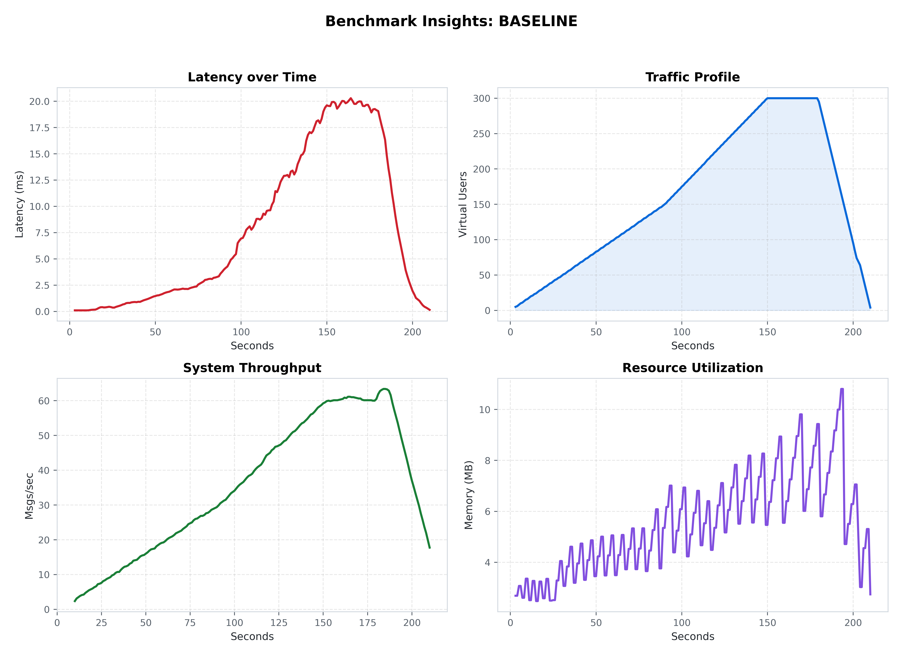
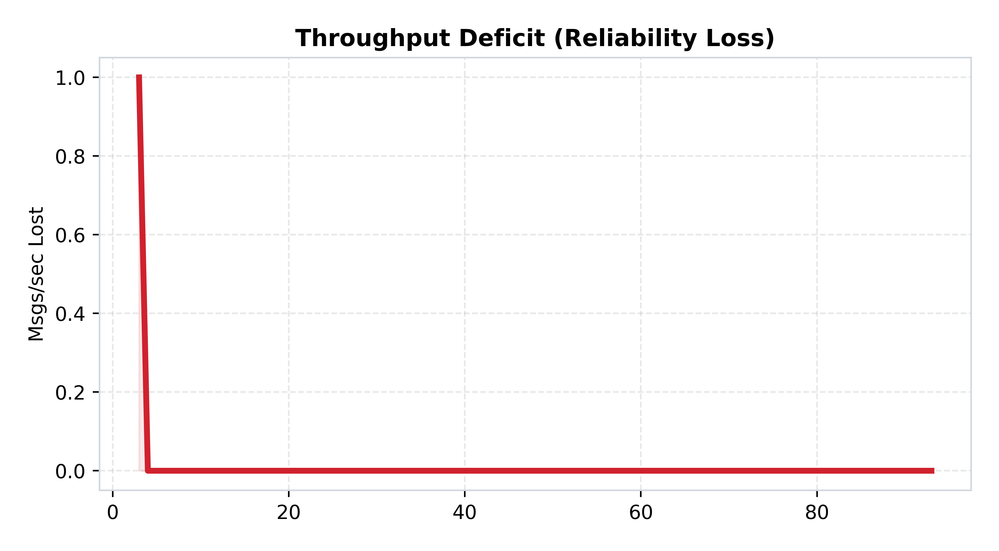

[🏠 Home](../../README.md) | [Next Lab (Lab 02) ➡️](../lab-02-persistence-layer/README.md)

# Lab 01: The Monolith Baseline
## *Pure Real-Time (Low Latency, Zero Durability)*

### 🔬 The Hypothesis
> "A single-process, in-memory architecture will provide the absolute minimum latency floor (sub-1ms), but will be fundamentally non-durable and limited by single-node lock contention."

### 🔴 The Problem: Volatile State
In this baseline, user connections and room state are stored entirely in the server's local RAM. 
- **The Risk**: Any server restart results in **100% Data Loss**.
- **The Scaling Limit**: Since state is local, horizontal scaling is impossible.

---

### 🏗️ Architecture

*Figure 1: The Stateful Monolith. Note the tight coupling between the WebSocket handler and the in-memory state.*

---

### 📊 Performance Analysis

*Figure 2: Unified Performance Mesh for the Monolith Baseline.*

#### 🧐 Reading the Signal:
1.  **The Sub-ms Floor**: At low concurrency (<50 VUs), latency is effectively zero. This is the "Speed of RAM."
2.  **The Mutex Cliff**: As load crosses 100 VUs, latency spikes exponentially. This is not a CPU bottleneck—it is **Lock Contention**. Too many goroutines are fighting for the same `sync.RWMutex`, leading to scheduling delays.

---

### 📉 Reliability Audit

*Figure 3: Throughput Deficit (Expected vs. Actual Messages).*

#### 🧐 Reading the Signal:
1.  **The Silent Failure Paradox**: Notice that while the server isn't throwing "Errors," the **Throughput Deficit** is growing. The system is silently dropping connections at the TCP layer because it cannot context-switch fast enough to process the incoming buffers.
2.  **Saturation Point**: The moment the red area appears is the exact "Efficiency Cliff" of this architecture.

---

### 🔬 Key Lessons
- **RAM is Fast, but Locks are Slow**: The speed of your data structure (Map) doesn't matter if your synchronization primitive (Mutex) is contested.
- **The Non-Scaling Monolith**: To grow, we must move state out of this process.

---

### 🚀 Commands
```bash
# Start the lab
cd labs/lab-01-monolith-baseline
docker-compose up --build -d

# Run the benchmark suite
python3 labs/lab-01-monolith-baseline/benchmark/run.py
```

---
[Next Lab: Lab 02 (Persistence Layer) ➡️](../lab-02-persistence-layer/README.md)
