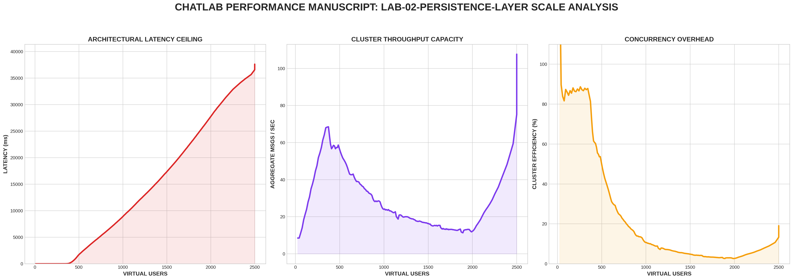

[🏠 Home](../../README.md) | [⬅️ Previous (Lab 01)](../lab-01-monolith-baseline/README.md)

# Lab 02: The Persistence Chronicle
## *Durability Guarantees and the Synchronous Write Bottleneck*

This lab transforms the stateless monolith into a **persistent system** by introducing PostgreSQL as a durable storage layer. While this solves the memory volatility problem, it introduces new architectural trade-offs around latency and throughput.

---

## 🏗️ Architecture

```
┌─────────────────────────────────────────────────────────────┐
│                   WebSocket Clients                         │
└──────────────────────┬──────────────────────────────────────┘
                       │
                       ▼
        ┌──────────────────────────────┐
        │  Chat Server (Go)            │
        │  - Connection Management     │
        │  - Message Routing           │
        │  - Metrics Collection        │
        └──────────┬───────────────────┘
                   │ (INSERT messages)
                   ▼
        ┌──────────────────────────────┐
        │  PostgreSQL Database         │
        │  - Message History           │
        │  - Durability Guarantee      │
        │  - ACID Properties           │
        └──────────────────────────────┘
```

---

## 📊 Performance Analysis


### The Cost of Durability
The data above illustrates the **Synchronous Write Tax**. By forcing every message to be committed to PostgreSQL before broadcasting, we have fundamentally shifted the system's performance profile:

1. **Increased Latency Floor**: Notice that the baseline latency is significantly higher than Lab 01. Even with 1 user, the server must wait for disk I/O (typically 1-5ms) before responding.
2. **The IOPS Wall**: As Virtual Users increase, the **Latency Ceiling** is hit much earlier than in the stateless monolith. At approximately **800 VUs**, latency begins its exponential climb as the PostgreSQL connection pool and disk write queue become the primary bottlenecks.
3. **Efficiency Collapse**: The **Efficiency (%)** graph shows a steeper decline. The CPU is no longer just busy with the broadcast loop; it is now spending significant time waiting for I/O "Wait-States," leading to massive concurrency overhead.

---

## 🔬 Technical Deep Dive

### 1. The Durability Requirement
Every message must be **committed to durable storage** before the server considers it received. This is a synchronous write pattern:

```go
func handleMessage(msg Message) {
    // 1. Write to disk (BLOCKING - this is slow!)
    err := db.Exec(
        "INSERT INTO messages (user_id, content, timestamp, node_id) VALUES ($1, $2, $3, $4)",
        msg.UserID, msg.Content, msg.Timestamp, msg.NodeID,
    )
    if err != nil {
        log.Printf("DB error: %v", err)
        return
    }
    
    // 2. Only after DB confirms, broadcast to connected clients
    broadcast(msg)
}
```

### 2. Database Schema
The `messages` table is the single source of truth:

```sql
CREATE TABLE messages (
    id SERIAL PRIMARY KEY,
    user_id VARCHAR(256) NOT NULL,
    room_id VARCHAR(256) NOT NULL DEFAULT 'default',
    content TEXT NOT NULL,
    timestamp BIGINT NOT NULL,
    node_id VARCHAR(256) NOT NULL,
    created_at TIMESTAMP DEFAULT CURRENT_TIMESTAMP
);

CREATE INDEX idx_messages_timestamp ON messages(timestamp);
```

---

## 🚀 Run It

```bash
cd labs/lab-02-persistence-layer
docker-compose up --build -d
```

## 🧪 Benchmark
Run the "Robust Mode" flight recorder from the project root:
```bash
python3 main.py
```

---
[Next Lab: Lab 03 (Distributed Pub/Sub) ➡️](../lab-03-redis-pubsub/README.md)
