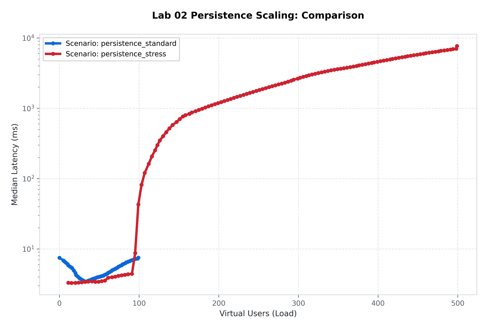
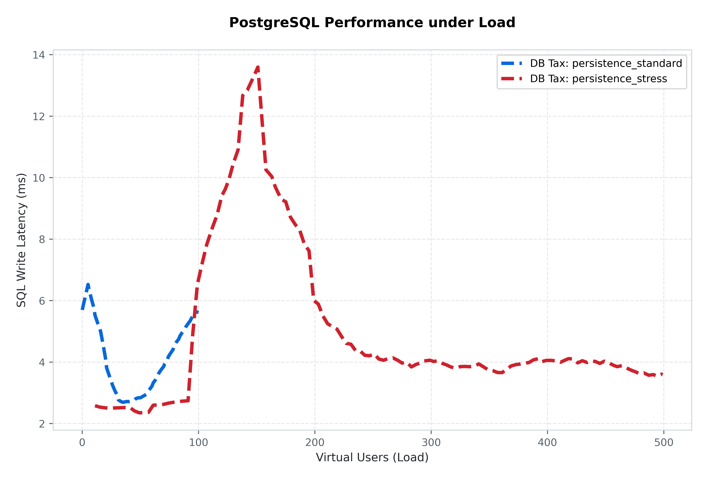

[🏠 Home](../../README.md) | [⬅️ Previous (Lab 01)](../lab-01-monolith-baseline/README.md) | [Next Lab (Lab 03) ➡️](../lab-03-redis-pubsub/README.md)

# Lab 02: The Persistence Layer
## *Durable State, SQL Overhead, and the Persistence Tax*

### 🔴 The Problem
In Lab 01, our chat was "Volatile." If the server crashed or restarted, every message was lost forever. For a real-world application, data must be **Durable**. However, writing to a disk-backed database (Postgres) is significantly slower than writing to RAM.
- **The Bottleneck**: Every message now requires a network round-trip to the database and a synchronous disk write.
- **The "Broadcast Lag"**: In a monolithic architecture, the server must wait for the database write to finish *before* it starts the broadcast loop.

### 🟢 The Approach
We introduce **PostgreSQL** to the architecture. Every incoming message is now persisted to a `messages` table before being broadcast to other users. This lab allows us to measure the **"Persistence Tax"**—the exact latency penalty incurred by moving from in-memory state to a durable database.

---

### 🏗️ Architecture
The system now consists of two primary tiers: the Application logic and the Database storage.

*Figure 1: Architectural view of the Persistent Monolith with PostgreSQL.*

---

### 📊 Performance Analysis (GitHub Modern)
We executed two distinct scenarios (**Standard** and **Stress**) to observe the "Persistence Tax" under variable load.

#### 📈 Suite Scaling Profile

*Figure 2: E2E Latency scaling. Note the exponential "Persistence Cliff" as concurrency passes 200 VUs.*

#### 🛡️ The Database "Tax" vs. Total Latency

*Figure 3: SQL Write Latency. Surprisingly, PostgreSQL remains fast (~5ms) even while the application latency (Figure 2) spikes to over 2,000ms.*

### 🔬 Deep Dive: The Persistence Paradox
Our analytics reveal a critical architectural insight: **PostgreSQL is not our bottleneck.** 
While the `SQL Persistence Tax` (Figure 3) stays consistently low at 3-5ms, the `Total E2E Latency` (Figure 2) explodes to 2.5 seconds.

**Why the gap?**  
Because this lab uses a **Synchronous Monolith**. The server waits for the DB write (5ms) and then enters a synchronous loop to broadcast that message to hundreds of clients. If 400 clients are connected, and each network write takes even 5ms, the loop takes **2,000ms** to finish. The database is fast, but the *way* we handle the database response is slow.

---

### 🚀 Commands
**Start the Lab:**
```bash
cd labs/lab-02-persistence-layer
docker-compose up --build -d
```

**Run Automated Benchmark Suite:**
```bash
# Runs Standard (100 VU) and Stress (500 VU) scenarios
python3 labs/lab-02-persistence-layer/benchmark/run.py --all
```

**Generate High-Res Analytics:**
```bash
python3 labs/lab-02-persistence-layer/benchmark/plot.py
```

---

### 📂 Folder Structure
- `services/chat-server/`: Go server with SQL integration.
- `benchmark/`: Automated orchestrator and analytics.
  - `run.py`: Captures SQL latency vs. App latency.
  - `plot.py`: 500 DPI GitHub-Modern suite analytics engine.
  - `workload.yaml`: Defines the Standard and Stress scenarios.
- `assets/benchmarks/`: Permanent storage for persistence analytics.

---
[Next Lab: Lab 03 (Redis Pub/Sub) ➡️](../lab-03-redis-pubsub/README.md)
