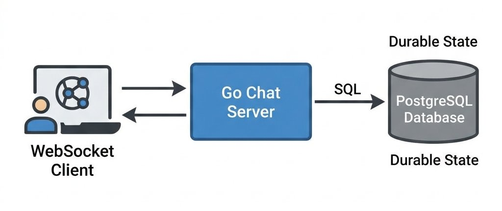
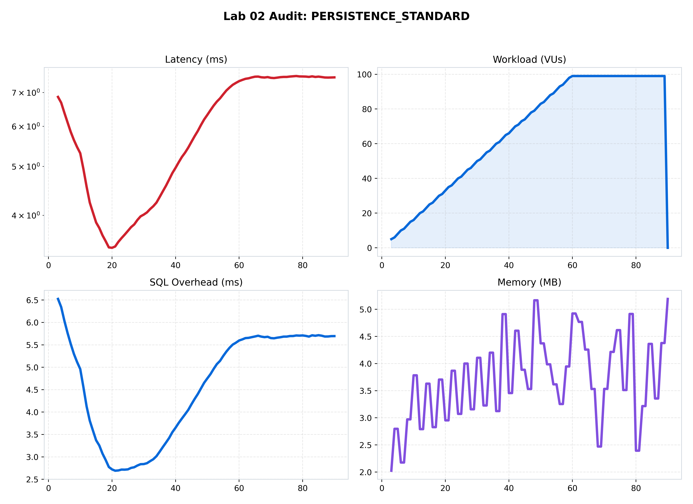
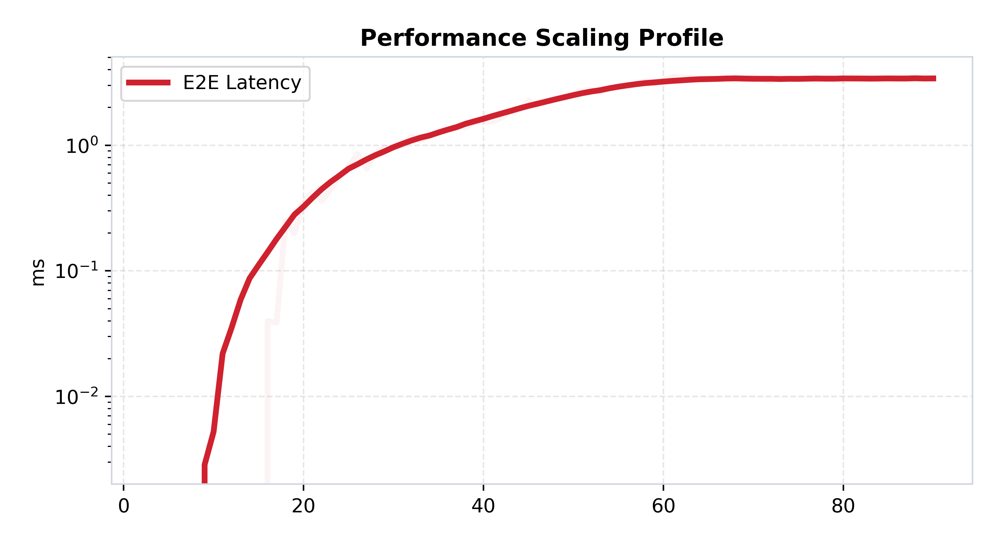
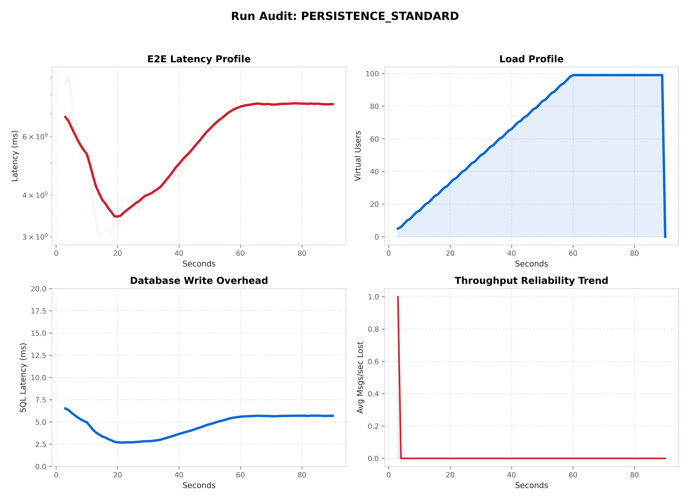

[🏠 Home](../../README.md) | [⬅️ Previous (Lab 01)](../lab-01-monolith-baseline/README.md) | [Next Lab (Lab 03) ➡️](../lab-03-redis-pubsub/README.md)

# Lab 02: The Persistence Layer
## *Durable State and the Persistence Tax*

**Purpose:** add durable storage to the chat path so messages can survive process restarts and support a history API.  
**Hypothesis:** persistence will improve correctness and usefulness, but it will increase end-to-end latency and expose a new bottleneck around database writes.

## Hook
This is the first durability checkpoint. Compare Lab 02 against Lab 01 to see the exact persistence tax you pay to stop losing messages on restart.

## Learning Outcomes
- Quantify how PostgreSQL writes affect p50 and p95 latency.
- Explain the difference between fast broadcast and durable write guarantees.
- Identify durability failure modes when the database path degrades.

## Why This Matters in Production
Most chat products need history, audits, and restart safety. This lab shows that durability is a business requirement with a measurable performance cost.

## Overview
This lab introduces one focused architectural step in the ChatLab evolution and captures measured trade-offs against the previous stage.

## Architecture
```text
Client -> Chat Server -> PostgreSQL + In-Memory Broadcast
```
See the architecture diagram in this README for the detailed topology.

## How to Run
### Quick Start (Docker)
```bash
docker-compose up --build
```

### Expected Result
- Durability should improve correctness and restart behavior.
- Latency should rise versus Lab 01 due to storage path overhead.

## What Changed From Previous Lab
See the detailed What Changed From Previous Lab section below for the exact deltas.

## Results
Use Performance Analysis plus benchmark artifacts in assets/benchmarks to validate this lab hypothesis.

## Limitations
See the detailed Limitations section below.

## Known Issues
- Tail latency can rise quickly during bursty or uneven load.
- Delivery and durability guarantees vary by architecture and workload shape.

## When This Architecture Fails
- Sustained concurrency exceeds local capacity, queue budget, or dependency limits.
- Dependency latency (DB/Redis/network) amplifies retries and causes cascading delay.

## Folder Structure
```text
lab-x/
  |- README.md
  |- docker-compose.yml
  |- benchmark/
  |- services/
  |- assets/
```

### 🎯 Objective
This lab upgrades the monolith from volatile in-memory messaging to database-backed message storage. The goal is to measure what changes when we add PostgreSQL, quantify the durability overhead, and make the performance-versus-durability trade-off concrete with real benchmark data.

### 🔁 What Changed From Previous Lab
- Lab 01 kept all message state in memory; Lab 02 writes messages into PostgreSQL.
- Lab 01 had no history endpoint; Lab 02 adds `/history` to read the latest 50 messages by room.
- Lab 01 measured only application-side message behavior; Lab 02 also measures DB write time separately through `chat_db_query_duration_ms`.
- Lab 01 lost everything on restart; Lab 02 can recover persisted rows after the app process comes back.
- Lab 01 only had an in-memory hot path; Lab 02 now has both an application hot path and a storage path, which is why performance changes.

### 🧩 Problem Statement
Lab 01 is fast, but every restart wipes out all chat history. Lab 02 solves that limitation by introducing a persistence layer so messages can outlive the server process, while also exposing the cost of that decision in latency, throughput, and operational complexity.

### 🏛️ System Architecture
```mermaid
graph TD
    Client[Client App] -->|WebSocket| Srv[Chat Server (Go)]
    subgraph "Persistent Monolith"
    Srv -->|Lock/Write| Mem[(In-Memory Active Sockets)]
    Srv -->|Async INSERT| DB[(PostgreSQL)]
    Srv -->|Scrape| Prom[Prometheus]
    end
```

**Data Flow:** Incoming client requests are handled by the server. Messages are asynchronously written to PostgreSQL for durability while simultaneously being broadcast to all active in-memory connections.

### 📌 Assumptions
- Single chat server node and single PostgreSQL node.
- Local Docker Compose deployment on one host; no cross-region or WAN latency.
- No replica set, failover coordinator, or multi-node write consistency.
- The benchmark harness samples Prometheus metrics once per second.
- Durability here means "message is written to Postgres when the async write succeeds"; the current implementation does not block broadcast on the write result.

### 🧠 Key Terms
- **Persistence**: Writing message state to storage outside the process.
- **Durability**: Expectation that acknowledged state survives process restarts or crashes.
- **Persistence tax**: The extra latency and throughput cost introduced by storage operations.
- **Read path**: The code path that loads message history from the database.
- **Write path**: The code path that records a new message into the database.
- **Tail latency**: High-percentile latency, especially p90 and p99.

### 🔄 Step-by-Step Request Flow
1. A client opens a WebSocket connection to `/ws`.
2. The server upgrades the request and stores the connection in the in-memory `clients` map.
3. The client sends a JSON chat message containing `user_id`, `room_id`, and `content`.
4. `processMessage()` stamps `timestamp` and `node_id`.
5. A goroutine attempts to `INSERT` the message into PostgreSQL, retrying up to 3 times with 100 ms backoff.
6. In parallel, the server immediately broadcasts the message to connected clients.
7. Prometheus captures end-to-end message latency and DB query duration.
8. The sender receives its echoed `message_id`, records `client_receive_ts`, and k6 computes true end-to-end latency as `client_receive_ts - client_send_ts`; clients can later fetch durable history through `/history?room_id=...`.

### 🔁 What Persistence Changes vs Lab 01
- Messages are now stored in a `messages` table instead of existing only in RAM.
- The system gains a history read path through `/history`.
- The message path now includes database I/O and retry logic.
- The server still retains an in-memory socket registry and a global mutex for broadcasts, so persistence does not remove the original single-node contention point.
- Broadcast and persistence are decoupled in the implementation, which reduces user-facing latency but weakens strict "write-before-ack" durability semantics.

### 🔴 The Problem
In Lab 01, our chat was "Volatile." If the server crashed or restarted, every message was lost forever. For a real-world application, data must be **Durable**. However, writing to a disk-backed database (Postgres) is significantly slower than writing to RAM.
- **The Bottleneck**: Every message now requires a network round-trip to the database and a synchronous disk write.

### 🟢 The Approach
We introduce **PostgreSQL** to the architecture. Every incoming message is now persisted to a `messages` table before being broadcast. This lab allows us to measure the **"Persistence Tax"**—the exact latency penalty incurred by moving from in-memory state to a durable database.

### 🛡️ Hardening Roadmap
1. **Durable Broker**: Transitioning from direct SQL writes to a distributed log like **Kafka** (see Lab 05).
2. **Horizontal Scaling**: Introducing a Load Balancer (Nginx) and multiple app instances (implemented in this lab).
3. **Partitioning**: Indexing and sharding the message table for high throughput.

---

### 🏗️ Architecture

*Figure 1: Architectural view of the Persistent Monolith with PostgreSQL.*

---

### 🧪 Benchmarking Methodology
- Driver: `k6/base.js`
- Orchestrator: `labs/lab-02-persistence-layer/benchmark/run.py`
- Comparison helper: `labs/lab-02-persistence-layer/benchmark/compare.py`
- Measurement path: k6 drives WebSocket traffic, the sampler collects Prometheus counters and histograms every 1 second, and results are written into `timeseries.csv`.
- Scenarios used in the checked-in artifacts:
  - `comparison_standard`: 100 VUs for 1 minute, 1000 ms message interval
  - `persistence_standard`: 100 VUs for 1 minute, 1000 ms message interval
  - `persistence_stress`: 500 VUs for 2 minutes, 500 ms message interval
- Payload shape: the comparison harness uses fixed-size JSON messages with `message_id`, `trace_id`, `client_send_ts`, `user_id`, `room_id`, and padded `content`; `comparison_standard` targets 256 bytes before WebSocket framing in both labs.
- Test environment recorded by the harness: local Docker Compose on Linux, 1-second scrape interval.
- Hardware note: exact CPU and RAM were not captured by the harness, so absolute values should be treated as host-dependent.

### 📏 Metrics Measured
- **p50 / p90 / p99 end-to-end latency**: Main user-visible responsiveness metrics.
- **p50 / p90 / p99 DB latency**: Isolates the PostgreSQL contribution to the path.
- **Average and peak throughput**: Shows how much work the system sustains.
- **Active VUs**: Expresses concurrency.
- **Peak memory**: Captures process memory footprint under load.
- **Dropped messages / DB errors**: Shows reliability or persistence issues.
- **Error rate**: Percentage of dropped messages and DB failures relative to processed messages.

Note: the shared benchmark dashboard no longer renders an SQL-overhead subgraph. Some labs do not export `chat_db_query_duration_ms_*`, and in those cases Prometheus-derived DB latency values default to 0 in sampled timeseries data.

### 🧪 Expected Results Before Running
- `comparison_standard` should produce higher p50/p90/p99 latency than Lab 01 because the durable path adds SQL work.
- DB write p50/p90/p99 should stay below total end-to-end latency, which helps separate storage cost from the rest of the request path.
- The sanity check should show `received` close to `sent` for sender echoes, with duplicates staying near zero.
- Under the `persistence_stress` scenario, tail latency should increase much faster than median latency because queueing and coordination dominate.

### 📈 Actual Benchmark Results
The numbers below are taken from the checked-in runs `lab02__persistence_standard__20260419T110451Z` and `lab02__persistence_stress__20260419T112350Z`. Percentiles are computed from the sampled latency series in `timeseries.csv`.

| Scenario | Duration | Peak VUs | p50 | p90 | p99 | Avg throughput | Peak throughput | Peak memory |
| --- | --- | --- | --- | --- | --- | --- | --- | --- |
| Standard | 90s | 99 | 6.39 ms | 7.75 ms | 9.25 ms | 66.15 msgs/s | 101.00 msgs/s | 5.19 MB |
| Stress | 150s | 499 | 2590.09 ms | 7678.09 ms | 7907.16 ms | 107.39 msgs/s | 227.00 msgs/s | 15.03 MB |

### 🗃️ Data Model / Schema
The persistence layer stores chat history in PostgreSQL using the following logical schema:

| Column | Type | Meaning |
| --- | --- | --- |
| `id` | `SERIAL PRIMARY KEY` | Monotonic row identifier |
| `user_id` | `TEXT` | Sender identity |
| `room_id` | `TEXT` | Chat room partition key |
| `content` | `TEXT` | Message body |
| `node_id` | `TEXT` | Server instance that handled the message |
| `created_at` | `TIMESTAMP WITH TIME ZONE` | Insert timestamp |

The read path uses an index on `room_id` and returns the latest 50 messages ordered by `created_at DESC`.

---

### 📊 Performance Analysis

*Figure 2: Unified view of Latency, Load, Throughput, and Resource Utilization.*

#### 🧐 Analysis:
1. **The Persistence Tax**: In the checked-in standard run, end-to-end latency lands at **p50 6.39 ms / p90 7.75 ms / p99 9.25 ms**. That shift above Lab 01 is the durability cost.
2. **The Scaling Profile**: 
   
  *Figure 3: Median latency response under increasing concurrency in the persistence-backed architecture.*

### 🧾 Interpretation
Performance changes here for a concrete reason, not a mysterious one. Each message now creates extra work: the server stamps metadata, schedules a database write, waits for SQL capacity to be available, and still has to serialize and broadcast to connected clients. Even when the write runs asynchronously, database pressure shows up in the tail because the application and storage paths now contend for the same single-node resources.

---

### 📉 Reliability Audit

*Figure 4: Throughput Deficit showing the gap between expected and actual processing.*

#### 🧐 Analysis:
- **Throughput Deficit**: As load increases, the database becomes the primary bottleneck. The red area shows where the server begins to fall behind because it is waiting for disk I/O on every single message.

---

### 🔁 Throughput vs Latency

*Figure 5: This overlay makes the trade-off explicit. Lab 01 sits lower on the latency curve, while Lab 02 pays extra latency to gain durable storage and a history read path.*

Use this combined graph as the primary Lab 01 vs Lab 02 comparison view. The separate per-lab plots are still useful for diagnosis, but this overlay is the clearest answer to "why did performance change?"

### ⏱️ Time-Series Stability View

*Figure 6: The run audit is the clearest time-series view of stability in Lab 02. It shows end-to-end latency, load, throughput, and reliability loss evolving together over time.*

### ⚖️ Lab 01 vs Lab 02 Comparison
The table below compares the checked-in Lab 01 baseline run against the Lab 02 standard persistence run. Both percentile sets come from their sampled `timeseries.csv` outputs.

| Dimension | Lab 01 Baseline | Lab 02 Standard | What changed |
| --- | --- | --- | --- |
| State model | In-memory only | In-memory + PostgreSQL | Lab 02 persists chat history |
| Peak concurrency in sample run | 300 VUs | 99 VUs | Different benchmark shapes, but both are useful reference points |
| p50 latency | 4.22 ms | 6.39 ms | Persistence adds median latency |
| p90 latency | 19.60 ms | 7.75 ms | Standard Lab 02 run is steadier because it applies lower concurrency |
| p99 latency | 21.73 ms | 9.25 ms | Tail stays controlled at modest durable load |
| Average throughput | 34.25 msgs/s | 66.15 msgs/s | Standard Lab 02 pushes more total work because messages are sent more frequently |
| Peak throughput | 70.00 msgs/s | 101.00 msgs/s | Higher send rate in the standard scenario raises observed throughput |
| Durability | None | Messages written to Postgres on successful async write | Lab 02 survives process restart better than Lab 01 |
| History API | No | Yes (`/history`) | Lab 02 adds a read path |

### ⚖️ Trade-Offs Introduced
- Durability improves because messages can be stored outside process memory.
- Median latency rises because the write path now includes PostgreSQL work.
- Operational complexity increases: there is now schema management, connection health, and DB retry behavior to reason about.
- The implementation reduces user-visible delay by broadcasting in parallel with persistence, but that means a failed write can still coincide with a visible broadcast.

### 💥 Failure Scenario Discussion
- **Database unavailable at startup**: the server retries connection up to 15 times with 3-second waits and then exits fatally if the database never becomes ready.
- **Database unavailable after startup**: `/health` reports `"database": "disconnected"`, but the JSON payload still reports overall service health as `"healthy"`.
- **Write failure during message processing**: the server retries the `INSERT` three times asynchronously. If all retries fail, it logs a critical data-loss warning.
- **Durability caveat**: because broadcast happens in parallel with the async write, a client can observe a message that never makes it to Postgres if all retries fail.

### 🚧 Limitations
- Still single-node on the application side; the broadcast mutex remains a contention hotspot.
- The current design does not provide strict write-before-broadcast durability guarantees.
- Benchmark percentiles here are derived from sampled Prometheus series rather than raw per-message k6 export percentiles.
- The checked-in workloads are not normalized across labs, so direct cross-lab throughput comparison should always be read alongside scenario shape and message interval.

---

### 🔬 Key Lessons
- **Durability isn't Free**: The move to PostgreSQL introduces a measurable latency increase.
- **The SQL Bottleneck**: Moving state to a database solves the "Restart Data Loss" problem but creates a new scaling limit centered on Database I/O.

### ✅ Key Takeaways
- Lab 02 is the first version of the system that can preserve chat history across server restarts.
- Persistence adds clear value, but it also introduces a measurable performance tax and new failure modes.
- The stress run shows that durability alone is not enough; once concurrency rises, the combined cost of database I/O and single-node coordination creates extreme tail latency.

---

### ▶️ Benchmark Command
```bash
python3 labs/lab-02-persistence-layer/benchmark/run.py --scenario comparison_standard
```

This comparable scenario uses the same payload target, 1-minute duration, and 100-VU shape as Lab 01. The benchmark now prints throughput every 5 seconds, end-to-end latency percentiles, DB write p50/p90/p99, a latency histogram, and a sanity check with sent vs received counts plus duplicate detection by `message_id`.

---

### 🚀 Commands
**Start the Lab:**
```bash
cd labs/lab-02-persistence-layer
docker-compose up --build -d
```

**Run Automated Benchmark:**
```bash
python3 labs/lab-02-persistence-layer/benchmark/run.py
```

**Generate Modern Graphs:**
```bash
python3 labs/lab-02-persistence-layer/benchmark/plot.py
```

---

### 📂 Folder Structure
- `services/chat-server/`: Go server with SQL integration.
- `benchmark/`: Automated orchestrator and analytics.
  - `run.py`: The automated benchmark orchestrator.
  - `plot.py`: The GitHub-Modern visualization engine.
- `assets/benchmarks/`: Permanent storage for persistence analytics.

---

### ⏭️ Next Lab Enablement
Lab 02 proves that durability can be added, but also shows the cost of keeping all coordination on one node. That sets up the next lab: move beyond a single durable monolith and start separating real-time fan-out from storage concerns.

---
[Next Lab: Lab 03 (Redis Pub/Sub) ➡️](../lab-03-redis-pubsub/README.md)
