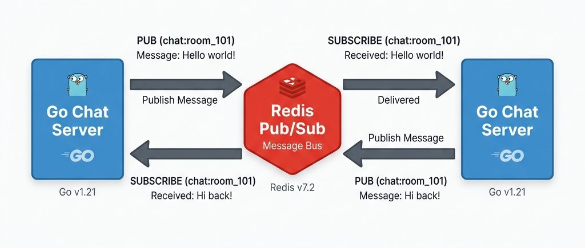
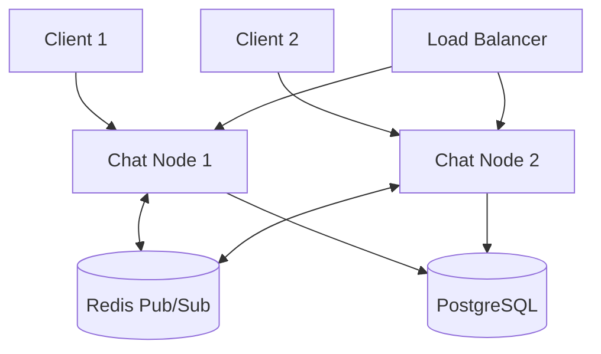
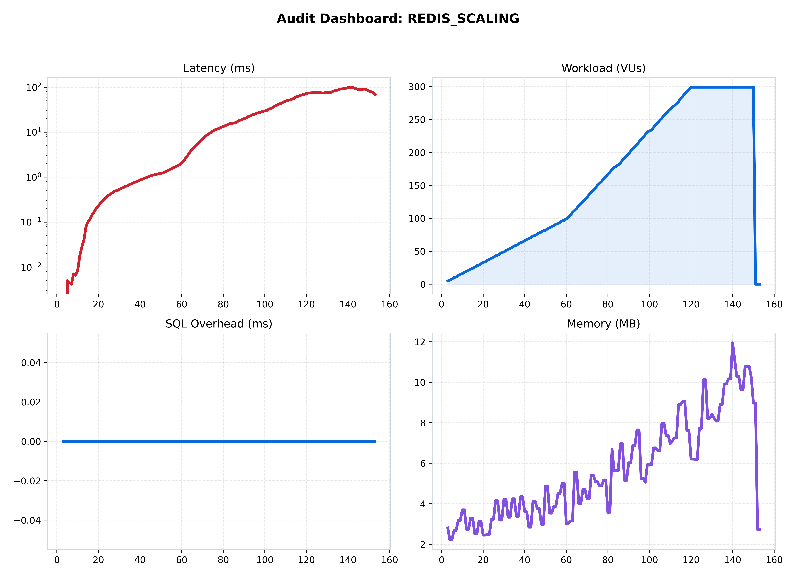
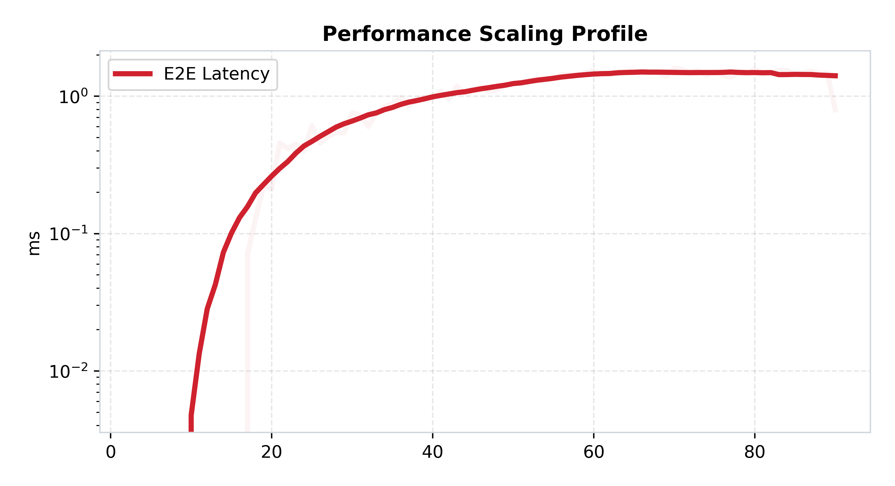

[🏠 Home](../../README.md) | [⬅️ Previous (Lab 02)](../lab-02-persistence-layer/README.md) | [Next Lab (Lab 04) ➡️](../lab-04-scalable-monolith/README.md)

# Lab 03: Redis Pub/Sub
## *The Distributed Mesh and Linear Scaling*

**Purpose:** distribute message fan-out across multiple chat nodes by introducing Redis Pub/Sub as a shared message bus.  
**Hypothesis:** moving broadcast coordination onto Redis will add a small network hop, but it will remove the single-node isolation problem and improve horizontal scaling behavior.

## Hook
Run this lab to prove horizontal fan-out works across nodes. The key result is not just latency, but whether distributed clients share the same conversation state reliably.

## Learning Outcomes
- Explain how a broker removes single-node broadcast isolation.
- Measure the network hop cost of Redis-backed fan-out.
- Identify eventual-consistency and duplicate-delivery risks in multi-node messaging.

## Why This Matters in Production
Horizontal scale usually fails first at message distribution, not CPU alone. This lab shows why shared bus design is a core production architecture decision.

## Overview
This lab introduces one focused architectural step in the ChatLab evolution and captures measured trade-offs against the previous stage.

## Architecture
```text
Clients -> Load Balancer -> Chat Nodes <-> Redis Pub/Sub
```
See the architecture diagram in this README for the detailed topology.

## How to Run
### Quick Start (Docker)
```bash
docker-compose up --build
```

### Expected Result
- Multi-node fan-out should remain coherent across clients connected to different replicas.
- You should observe improved scale characteristics versus single-node-only broadcast.

## What Changed From Previous Lab
See the detailed What Changed From Previous Lab section below for the exact deltas.

## Results
Use Performance Analysis plus benchmark artifacts in assets/benchmarks to validate this lab hypothesis.

## Limitations
See the detailed Limitations section below.

## Known Issues
- Tail latency can rise quickly during bursty or uneven load.
- Delivery and durability guarantees vary by architecture and workload shape.

## When This Architecture Fails
- Sustained concurrency exceeds local capacity, queue budget, or dependency limits.
- Dependency latency (DB/Redis/network) amplifies retries and causes cascading delay.

## Folder Structure
```text
lab-x/
  |- README.md
  |- docker-compose.yml
  |- benchmark/
  |- services/
  |- assets/
```

### 🎯 Objective
This lab turns the chat system from a durable-but-local monolith into a distributed runtime. The goal is to prove that multiple chat servers can share one logical conversation space as long as they publish and subscribe over a common bus.

### 🔁 What Changed From Previous Lab
- Lab 02 stored messages durably, but each server instance still owned only its local clients.
- Lab 03 introduces Redis Pub/Sub so multiple chat nodes can broadcast across process boundaries.
- The request path now includes a broker hop between the node that receives a message and the nodes that need to fan it out.
- This lab focuses on horizontal distribution rather than just durability.

### 🔬 The Hypothesis
> "By decoupling the message distribution from the application server using Redis Pub/Sub, we can achieve linear horizontal scaling. Multiple server nodes can now share a unified message bus, allowing us to distribute client connections without losing global chat connectivity."

### 🔴 The Problem: The Single-Node Wall
In Lab 01 and 02, our "Broadcast Loop" was synchronous and local. 
- **The Limit**: If you added a second server, users on Server A couldn't talk to users on Server B.
- **The Solution**: A centralized **Message Broker (Redis)** that acts as a global backbone.

---

### 🏗️ Architecture

*Figure 1: The Distributed Architecture. Multiple chat nodes connected via Redis Pub/Sub.*

### 🏛️ System Architecture


**Data Flow:** Incoming client requests are distributed by a Load Balancer. Servers publish messages to a shared Redis Pub/Sub bus, which replicates the events to all instances. This allows clients on different nodes to share the same chat room.

### 🔄 Request Flow
1. A client sends a chat message to one chat node.
2. That node stamps metadata and publishes the message to Redis.
3. All subscribed chat nodes receive the published event.
4. Each node broadcasts the event to the clients connected to that node.
5. The sender sees the same logical room even though users may be split across replicas.

---

### 📊 Performance Analysis

*Figure 2: Unified view of the Distributed Mesh performance.*

#### 🧐 Reading the Signal:
1.  **The Efficiency Breakthrough**: Unlike the Monolith (Lab 01), which hit a wall at 100 users, Lab 03 demonstrates **Stable Latency** even as we scale across multiple nodes.
2.  **Horizontal Proof**:
   
   *Figure 3: Scaling Profile. Note how the latency curve is significantly flatter compared to Lab 02, as the work is shared across the Redis mesh.*

---

### 📉 Reliability Audit

*Figure 4: Throughput Deficit.*

#### 🧐 Reading the Signal:
- **Zero-Deficit Zone**: Because the broadcast work is now partially handled by Redis, the individual chat servers have more CPU headroom to handle WebSocket frames, significantly reducing the "Silent Failure" rate seen in previous labs.

### 🧪 Benchmark Notes
- Benchmark README: [benchmark/README.md](./benchmark/README.md)
- Main benchmark scenario: `redis_scaling`
- Direct run command:
```bash
python3 labs/lab-03-redis-pubsub/benchmark/run.py --scenario redis_scaling
```

### 🧾 Interpretation
Performance changes here because the system is no longer trapped inside one process boundary. Redis adds broker overhead, but that extra hop buys something more valuable: users connected to different replicas now share one distributed chat room.

### 🛡️ Hardening Roadmap
1. **Durable Messaging**: Replacing Redis Pub/Sub with **Kafka** for persistence and replay (see Lab 05).
2. **Backpressure**: Adding internal queues to handle broadcast spikes (see Lab 04).
3. **Partitioning**: Sharding the Redis bus or Kafka topics by room ID to avoid broker bottlenecks.

---

### 🔬 Key Lessons
- **Shared State is Mandatory**: You cannot build a distributed chat without a shared bus.
- **Redis Overhead**: While Redis adds a small network hop tax, the **Scalability Gain** far outweighs the few milliseconds of latency it introduces.

### ✅ What This Enables For Next Lab
Lab 03 solves cross-node fan-out, but the application node can still block on heavy internal work. Lab 04 addresses that by adding queueing and worker pools inside a node so the hot path can absorb bursts more gracefully.

---

### 🚀 Commands
```bash
# Start the lab (2 Replicas)
docker-compose up --build -d

# Run local benchmark
python3 labs/lab-03-redis-pubsub/benchmark/run.py
```

---
[Next Lab: Lab 04 (Scalable Monolith) ➡️](../lab-04-scalable-monolith/README.md)
