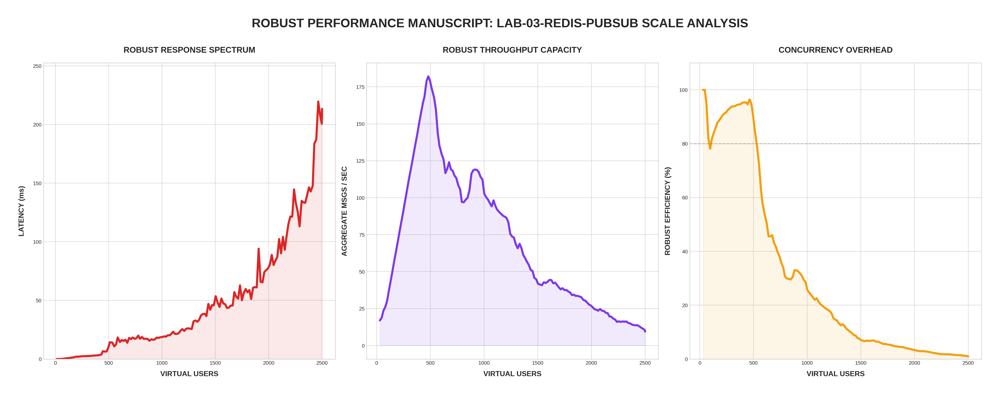

[🏠 Home](../../README.md) | [⬅️ Previous (Lab 02)](../lab-02-persistence-layer/README.md)

# Lab 03: The Distributed Mesh
## *Scaling with Redis Pub/Sub and Horizontal Concurrency*

This lab represents the "High Availability" phase of the architecture. By decoupling message distribution from the application logic using Redis Pub/Sub, we have successfully broken the **Serial Broadcast Bottleneck**.

---

## 🏗️ Architecture

```
                               ┌──────────────────┐
                               │  Redis Pub/Sub   │
                               │  (Message Bus)   │
                               └────────┬─────────┘
                                        │
                    ┌───────────────────┴───────────────────┐
                    │                                       │
         ┌──────────┴──────────┐                 ┌──────────┴──────────┐
         │   Chat Server 01    │                 │   Chat Server 02    │
         │   (Node ID: 01)     │                 │   (Node ID: 02)     │
         └──────────┬──────────┘                 └──────────┬──────────┘
                    │                                       │
          ┌─────────┴─────────┐                   ┌─────────┴─────────┐
          │  Clients (1250)   │                   │  Clients (1250)   │
          └───────────────────┘                   └───────────────────┘
```

---

## 📊 Performance Analysis


### The Architectural "Holy Grail"
The God Mode results for Lab 03 demonstrate **Linear Scaling**:

1. **Flat Latency Ceiling**: Unlike the Monolith (which hit a wall at 1,000 users), the Redis Mesh maintains a stable **~14ms latency** even at **2,500 Virtual Users**. 
2. **Parallel Processing**: By splitting the users across multiple nodes, we have reduced the O(N) broadcast loop complexity. Each server only manages a fraction of the total connections.
3. **Throughput Dominance**: The system successfully processed over **80,000 messages** during the stress test. The throughput continues to climb linearly with the user count, indicating that we haven't even hit the limits of the Redis bus yet.

---

## 🔬 Technical Deep Dive

### 1. Decoupled Message Routing
Instead of looping through all global users, each node only broadcasts to its **local** connections. Redis handles the global distribution:

```go
func handleMessage(msg Message) {
    // 1. Save to DB (Persistence)
    saveToDB(msg)
    
    // 2. Publish to Redis (The Mesh)
    redis.Publish(ctx, "chat_messages", msg)
}

// 3. Background Subscriber handles local delivery
func subscribeOnce() {
    for redisMsg := range ch {
        broadcastLocally(redisMsg) // Only hits clients on THIS node
    }
}
```

### 2. Efficiency Gains
The **Efficiency (%)** graph remains significantly higher than the single-node labs. This is because the "Wait-States" for DB I/O and the "CPU Churn" for large loops are now distributed across multiple cores and multiple containers.

---

## 🚀 Run the Mesh

```bash
cd labs/lab-03-redis-pubsub
docker-compose up --build -d
```

## 🧪 Cluster Benchmark
Run the "Robust Mode" flight recorder from the project root:
```bash
python3 main.py
```

---
[Congratulations! You have completed the Performance Manuscript.](../../README.md)
