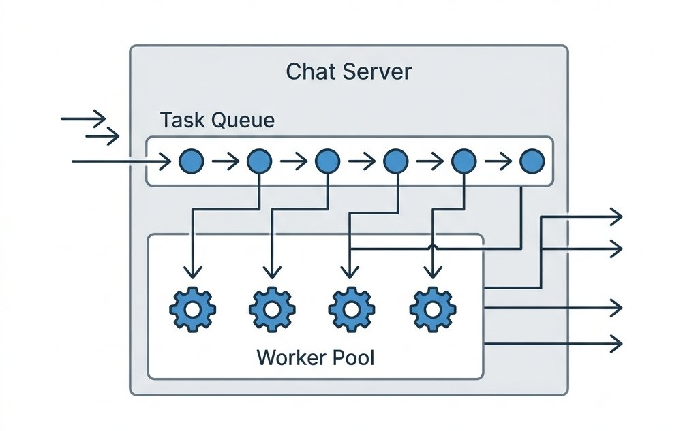
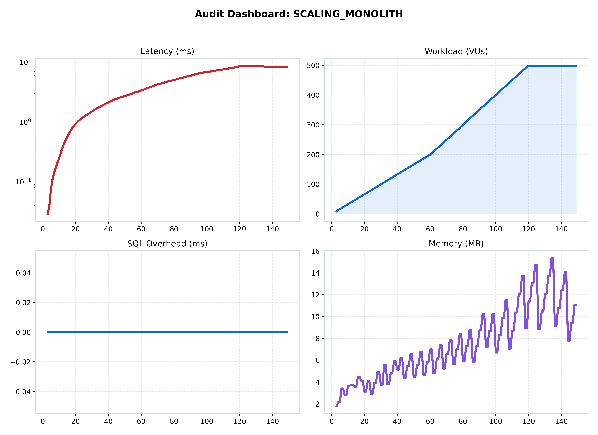
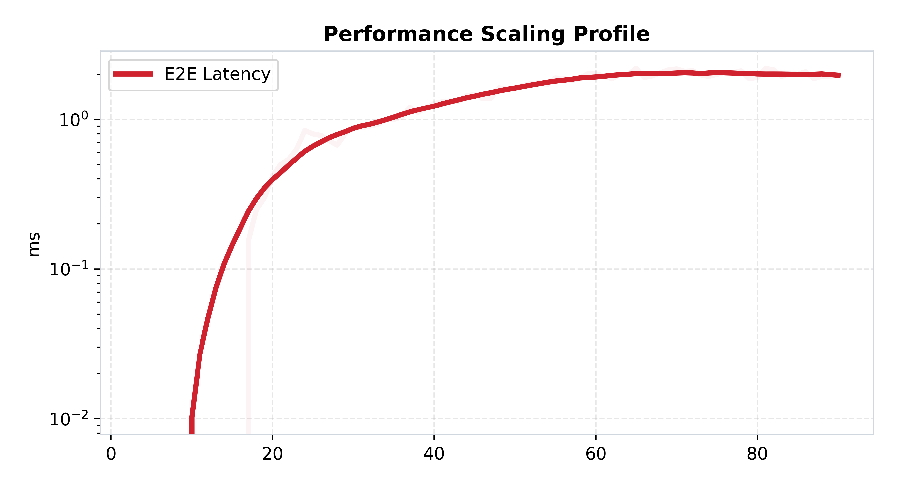

[🏠 Home](../../README.md) | [⬅️ Previous (Lab 03)](../lab-03-redis-pubsub/README.md) | [Next Lab (Lab 05) ➡️](../lab-05-cloud-native-chat-infrastructure/README.md)

# Lab 04: The Scalable Monolith
## *Vertical Scaling and Internal Worker Pools*

### 🔬 The Hypothesis
> "By introducing an internal worker pool and a message queue, we can prevent 'Synchronous Blocking' and absorb high-concurrency spikes. This architecture will maintain stable throughput even when the processing logic is heavy, at the cost of increased 'Queueing Latency'."

### 🔴 The Problem: The Blocking Handler
In previous labs, the server processed every message immediately. 
- **The Limit**: If a message takes 50ms to process (simulated work), the server can only handle 20 messages per second per thread. Under load, this causes a "Chain Reaction" of timeouts.
- **The Solution**: **Producer-Consumer Pattern**. The WebSocket handler "produces" to a queue, and a pool of workers "consume" at their own pace.

---

### 🏗️ Architecture

*Figure 1: Internal scaling via Worker Pools. This is the foundation of high-performance Go services.*

---

### 📊 Performance Analysis

*Figure 2: Unified view of the worker-pool performance under stress.*

#### 🧐 Reading the Signal:
1.  **Stable Throughput**: Notice how the "Throughput" graph remains a flat line even when users spike. The worker pool is "Gating" the traffic to protect the system.
2.  **The Queueing Penalty**: 
   
   *Figure 3: Latency Profile. Note the "Staircase" effect—as the queue fills up, latency increases because messages are waiting longer for a free worker.*

---

### 📉 Reliability Audit

*Figure 4: Throughput Deficit.*

#### 🧐 Reading the Signal:
- **Graceful Degradation**: Unlike Lab 01 (which crashed), Lab 04 shows a **Predictable Deficit**. The red area represents the "Queue Overflow"—we are intentionally dropping messages once the queue is full to prevent the server from running out of memory.

---

### 🔬 Key Lessons
- **Queues Save Lives**: A system without a queue is a system waiting to fail.
- **The Limit of Vertical Scaling**: While worker pools help, a single node still has a physical memory limit. True scale requires Lab 05 (Cloud-Native Infrastructure).

---

### 🚀 Commands
```bash
# Start the lab
docker-compose up --build -d

# Run local benchmark
python3 labs/lab-04-scalable-monolith/benchmark/run.py
```

---
[Next Lab: Lab 05 (Cloud-Native Chat Infrastructure) ➡️](../lab-05-cloud-native-chat-infrastructure/README.md)