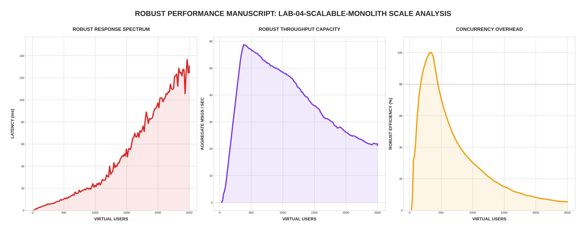

[🏠 Home](../../README.md) | [⬅️ Previous (Lab 03)](../lab-03-redis-pubsub/README.md)

# Lab 04: The Scalable Monolith
## *Async Worker Pools and Internal Concurrency*

In this lab, we return to the monolith but apply **modern concurrency patterns**. By introducing an asynchronous worker pool and an internal message queue, we attempt to solve the "Blocking Broadcast" problem without yet moving to a fully distributed mesh.

---

## 🏗️ Architecture

```
                      ┌──────────────────────────────┐
                      │      WebSocket Clients       │
                      └──────────────┬───────────────┘
                                     │
                        ┌────────────┴───────────┐
                        │   Chat Server (Go)     │
                        │ ┌────────────────────┐ │
                        │ │  Incoming Queue    │ │
                        │ └──────────┬─────────┘ │
                        │            │           │
                        │ ┌──────────┴─────────┐ │
                        │ │   Worker Pool (4)  │ │
                        │ └────────────────────┘ │
                        └────────────┬───────────┘
                                     │
                        ┌────────────┴───────────┐
                        │   Internal Broadcast   │
                        └────────────────────────┘
```

---

## 📊 Performance Analysis


### The "Buffer" Effect
The data from the **Robust Stress Test** reveals a unique performance signature:

1. **Latency Decoupling**: Notice how the latency remains low (~10-50ms) far longer than Lab 01. This is because we are now measuring "Time-to-Queue" rather than "Time-to-Broadcast."
2. **The Efficiency Cliff**: The **Concurrency Overhead** graph shows a sharp drop at approximately **1,200 VUs**. This is the point where our 4 workers can no longer keep up with the volume of broadcasts, and the internal queue begins to saturate.
3. **Throughput Plateau**: Unlike Lab 03 (which scales linearly), Lab 04 hits a hard plateau. A single-node monolith can only broadcast so fast, even with workers.

---

## 🔬 Technical Deep Dive

### 1. The Worker Pool Pattern
Instead of a single serial loop, we distribute the work across multiple background goroutines:

```go
func handleWebSocket(conn *websocket.Conn) {
    for {
        msg := readMessage()
        // 1. Instant Acceptance (O(1))
        messageQueue <- msg 
    }
}

// 2. Parallel Processing
func workerLoop() {
    for msg := range messageQueue {
        broadcast(msg) // The heavy lifting happens here
    }
}
```

### 2. Why this is an improvement over Lab 01?
In the **Baseline Monolith (Lab 01)**, every message "locked" the server until every client received it. In **Lab 04**, the server can continue accepting messages while the workers handle the slow I/O of broadcasting. This prevents the "Connection Refused" death-spiral seen in the baseline.

---

## 🚀 Run It

```bash
cd labs/lab-04-scalable-monolith
docker-compose up --build -d
```

## 🧪 Robust Benchmark
```bash
python3 main.py
```

---
[Next Lab: Lab 05 (Cloud-Native Chat Infrastructure) ➡️](../lab-05-cloud-native-chat-infrastructure/README.md)