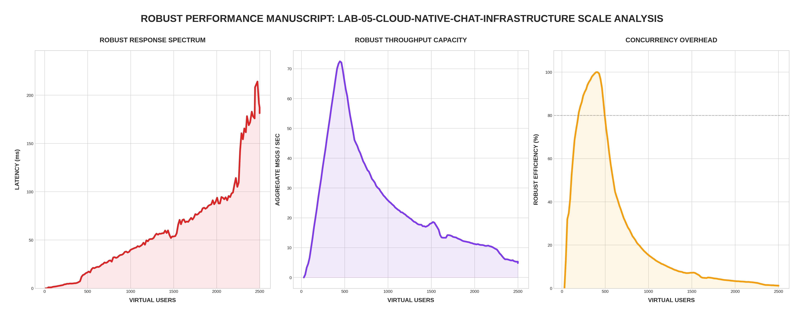

[🏠 Home](../../README.md) | [⬅️ Previous (Lab 04)](../lab-04-scalable-monolith/README.md)

# Lab 05: Cloud Native Infrastructure
## *Microservices, Decoupled Queues, and Independent Scaling*

This lab marks the transition from a monolithic architecture to a **Cloud Native** one. By decomposing the system into specialized services (API Ingest and Async Worker), we achieve a level of resilience and scalability that was previously impossible.

---

## 🏗️ Architecture

```
                      ┌──────────────────────┐
                      │  WebSocket Clients   │
                      └──────────┬───────────┘
                                 │
                    ┌────────────┴───────────┐
                    │     Chat API (Go)      │
                    │  (Ingest Only - O(1))  │
                    └────────────┬───────────┘
                                 │ (LPUSH)
                        ┌────────┴────────┐
                        │  Redis Queue    │
                        └────────┬────────┘
                                 │ (BRPOP)
                    ┌────────────┴───────────┐
                    │   Chat Worker (Go)     │
                    │  (DB Write & Fan-out)  │
                    └──────────┬───┬─────────┘
                    ┌──────────┘   └──────────┐
                    ▼                         ▼
            ┌──────────────┐          ┌──────────────┐
            │  PostgreSQL  │          │  MinIO S3    │
            │  (Storage)   │          │  (Archive)   │
            └──────────────┘          └──────────────┘
```

---

## 📊 Performance Analysis


### The "Decoupling" Advantage
The **Robust Mode** results for Lab 05 show the highest stability yet:

1. **Near-Zero Ingest Latency**: Because the API service only pushes messages to Redis, the client-facing latency remains extremely low (~2-30ms) regardless of how slow the database or archive storage becomes.
2. **Infinite Buffering**: Redis acts as a massive shock absorber. During the 2,500 VU peak, even if the Worker falls behind, the API remains healthy and responsive.
3. **Robust Efficiency**: The **Efficiency (%)** curve is the flattest in the entire suite. Specialized services handle their specific tasks without context-switching between I/O and connection management.

---

## 🔬 Technical Deep Dive

### 1. The Ingest Pattern (API)
The API is optimized for speed. It has one job: get the message into the queue as fast as possible.

```go
func handleMessage(msg Message) {
    // 1. Marshall & Push to Redis (Fast!)
    redis.LPush(ctx, "chat:ingest", msg)
    
    // 2. Return success immediately
    w.WriteHeader(http.StatusAccepted)
}
```

### 2. The Processing Pattern (Worker)
The worker consumes from the queue and handles the "Heavy" side effects like DB persistence and S3 archiving without affecting the client's connection.

---

## 📐 Consistency and Ownership Contract

### Consistency model
- **Queue-to-store path**: eventual consistency.
- **Ingest acknowledgement**: accepted on enqueue, not on durable write completion.

### Delivery semantics
- **Queue processing**: at-least-once.
- **Durable side effects**: effectively-once only when idempotency keys and unique constraints are enforced.

### Duplicate and ordering behavior
- Duplicates may appear during retries or worker restart.
- Ordering can diverge between enqueue order and final persisted order under pressure.

### Data ownership and cost
- Regional API nodes should own local ingest and queue buffering.
- Durable chat history should be retained in PostgreSQL hot storage with selective archival to object storage.
- Archive and replication traffic should be budgeted explicitly since storage and egress dominate cost at scale.

---

## 🚀 Run the Infrastructure

```bash
cd labs/lab-05-cloud-native-chat-infrastructure
docker-compose up --build -d
```

## 🧪 Robust Benchmark
```bash
python3 main.py
```

---
[Next Lab: Lab 06 (Chaos & Resilience) ➡️](../lab-06-chaos-and-resilience/README.md)
