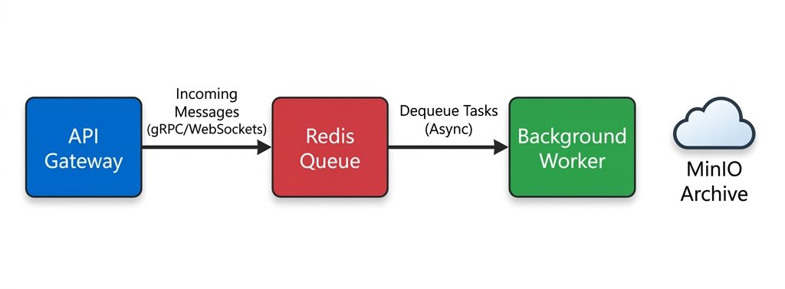
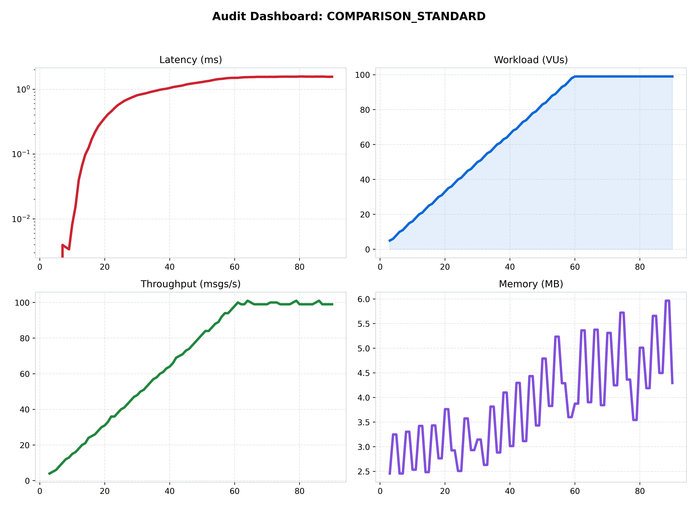
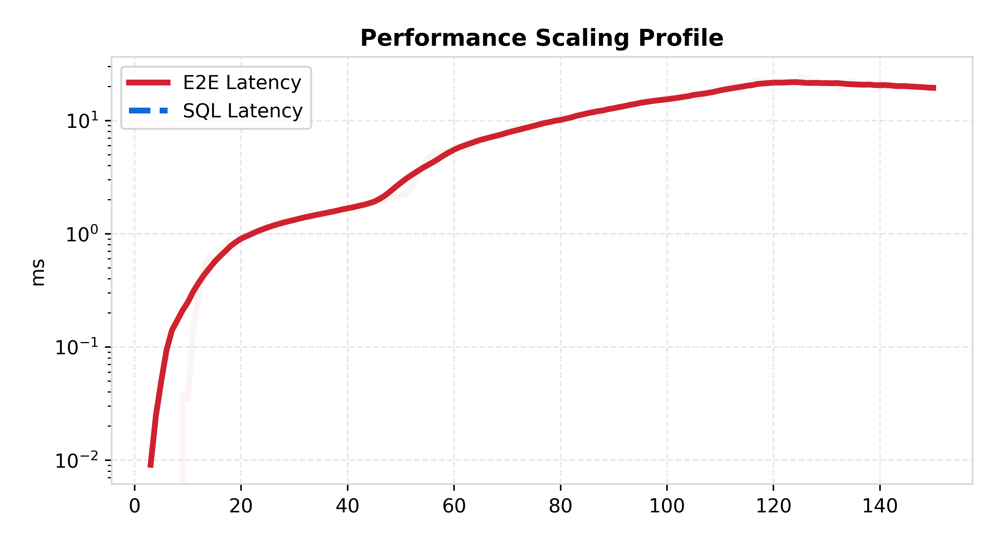
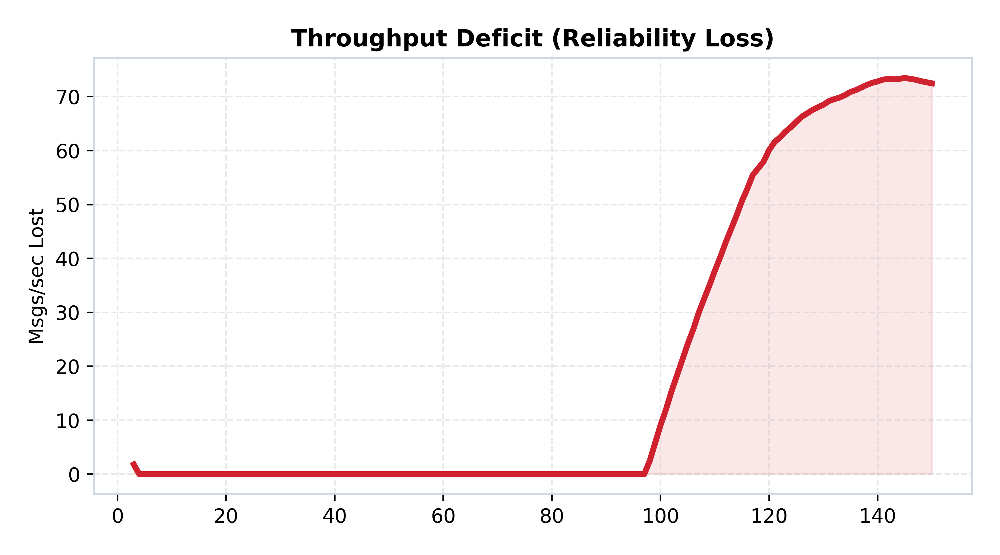

[🏠 Home](../../README.md) | [⬅️ Previous (Lab 04)](../lab-04-scalable-monolith/README.md) | [Next Lab (Lab 06) ➡️](../lab-06-chaos-and-resilience/README.md)

# Lab 05: Cloud-Native Chat Infrastructure
## *Decoupled Pipelines and Object Storage*

**Purpose:** decouple the ingest path from the processing path so the API can stay fast while background workers handle heavier storage work.  
**Hypothesis:** pushing work into Redis and letting workers handle slower storage tasks will keep ingest latency low even when downstream processing is expensive.

## Hook
This lab is where async architecture starts paying off. Validate whether separating ingest from heavy processing protects user-facing latency during load spikes.

## Learning Outcomes
- Explain how queue decoupling changes ingest latency behavior.
- Measure the trade-off between responsiveness and eventual completion semantics.
- Identify backlog-related failure modes before user-visible outages.

## Why This Matters in Production
Production traffic is bursty. This pattern lets systems absorb spikes without immediately degrading user-facing APIs, at the cost of delayed downstream completion.

## Overview
This lab introduces one focused architectural step in the ChatLab evolution and captures measured trade-offs against the previous stage.

## Architecture
```text
Client -> API Ingest -> Queue -> Worker -> Durable Storage
```
See the architecture diagram in this README for the detailed topology.

## How to Run
### Quick Start (Docker)
```bash
docker-compose up --build
```

### Expected Result
- Ingest latency should remain lower during bursts than synchronous processing designs.
- Queue lag and worker pressure should become the key stability signals.

## What Changed From Previous Lab
See the detailed What Changed From Previous Lab section below for the exact deltas.

## Results
Use Performance Analysis plus benchmark artifacts in assets/benchmarks to validate this lab hypothesis.

## Limitations
See the detailed Limitations section below.

## Known Issues
- Tail latency can rise quickly during bursty or uneven load.
- Delivery and durability guarantees vary by architecture and workload shape.

## When This Architecture Fails
- Sustained concurrency exceeds local capacity, queue budget, or dependency limits.
- Dependency latency (DB/Redis/network) amplifies retries and causes cascading delay.

## Folder Structure
```text
lab-x/
  |- README.md
  |- docker-compose.yml
  |- benchmark/
  |- services/
  |- assets/
```

### 🎯 Objective
This lab separates "accepting a message" from "fully processing and archiving a message." The goal is to make the critical path extremely thin while moving durable and archival work behind a queue-driven worker.

### 🔁 What Changed From Previous Lab
- Lab 04 used internal workers inside one node; Lab 05 splits ingest and processing into separate services.
- The API now writes quickly into Redis while a worker handles heavier tasks later.
- MinIO is introduced as an object-storage layer for archival concerns.
- The system becomes more cloud-native because ingestion and processing can scale independently.

### 🔬 The Hypothesis
> "By decoupling the ingest path (API) from the processing path (Worker) using a Redis Queue, we can achieve high 'Burst Tolerance.' The system will accept messages at wire-speed and process them asynchronously, allowing us to leverage scalable Object Storage (MinIO) for long-term archiving without affecting real-time latency."

### 🔴 The Problem: The Heavyweight Worker
In Lab 04, if a worker was slow, the whole server lagged. 
- **The Limit**: If you want to archive messages to S3/MinIO, the write time can be unpredictable. 
- **The Solution**: **Micro-Batching & Async Processing**. The API node only writes to a fast Redis Queue. A separate Worker node pulls from Redis and handles the heavy lifting (Postgres writes + MinIO archiving).

---

### 🏗️ Architecture

*Figure 1: The Cloud-Native Pipeline. API Gateway -> Redis Stream -> Background Worker -> Object Storage.*

### 🏛️ System Architecture (Structured View)
```text
Client
  -> API node
     -> enqueue to Redis
  -> worker
     -> consume queue
     -> write durable state
     -> archive to object storage
```

### 🔄 Request Flow
1. The client sends a message to the API node.
2. The API quickly enqueues the work into Redis.
3. The API responds without waiting for the full archival path to complete.
4. A worker drains the queue asynchronously.
5. The worker performs durable writes and object-storage archival in the background.

---

### 📊 Performance Analysis

*Figure 2: Performance mesh showing the decoupled API response times.*

#### 🧐 Reading the Signal:
1.  **Ingest Speed**: Notice that "Latency" (API response) remains incredibly low even as the workload spikes. This is because the API is only doing a single Redis `LPUSH`.
2.  **The Decoupling Proof**:
   
   *Figure 3: API Latency vs Load. The flat line proves that the "Heavy" processing (DB/MinIO) has been successfully removed from the critical path.*

---

### 📉 Reliability Audit

*Figure 4: Throughput Deficit.*

#### 🧐 Reading the Signal:
- **Queue Buffering**: Unlike previous labs where "Deficit" meant "Dropped Data," in Lab 05, a deficit often just means the **Worker is behind**. The messages are safe in the Redis Queue and will be processed once the load subsides. This is **Durability by Design**.

### 🧪 Benchmark Notes
- Benchmark README: [benchmark/README.md](./benchmark/README.md)
- Main benchmark scenario: `cloud_native_ingest`
- Direct run command:
```bash
python3 labs/lab-05-cloud-native-chat-infrastructure/benchmark/run.py --scenario cloud_native_ingest
```

### 🧾 Interpretation
Performance changes because the synchronous API path is no longer responsible for every expensive side effect. The benchmark mainly shows ingest behavior, so low API latency here should be read together with queue depth and worker lag, not as proof that all downstream work is free.

### 🚧 Limitations
- A fast API can hide a slow worker for a while, but backlog still accumulates.
- Redis becomes both a buffer and a dependency.
- Eventual completion matters now as much as immediate response time.

---

### 🔬 Key Lessons
- **Critical Path Management**: Never do I/O (Disk/S3) in a WebSocket handler.
- **Object Storage vs. Relational**: PostgreSQL handles the "Real-Time History," while MinIO handles the "Permanent Archive."

### ✅ What This Enables For Next Lab
Lab 05 decouples the path, but queued systems still fail badly if downstream components degrade without control. Lab 06 adds circuit breakers, retries, and dead-letter handling so the pipeline can fail more safely.

---

### 🚀 Commands
```bash
# Start the full stack (API, Worker, Redis, DB, MinIO)
docker-compose up --build -d

# Run local benchmark
python3 labs/lab-05-cloud-native-chat-infrastructure/benchmark/run.py
```

---
[Next Lab: Lab 06 (Chaos & Resilience) ➡️](../lab-06-chaos-and-resilience/README.md)
