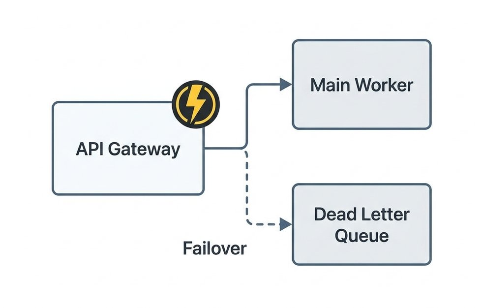
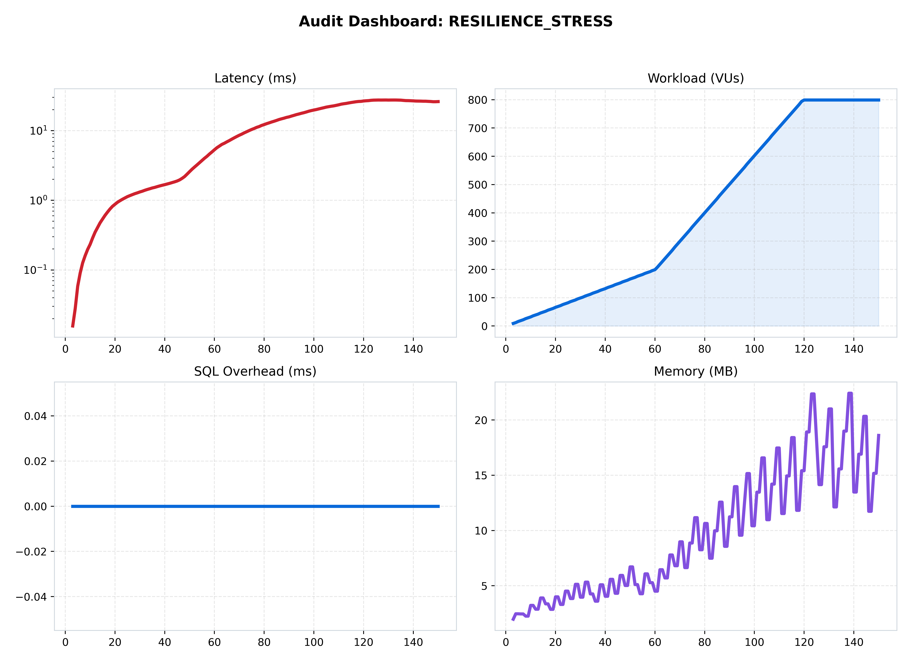
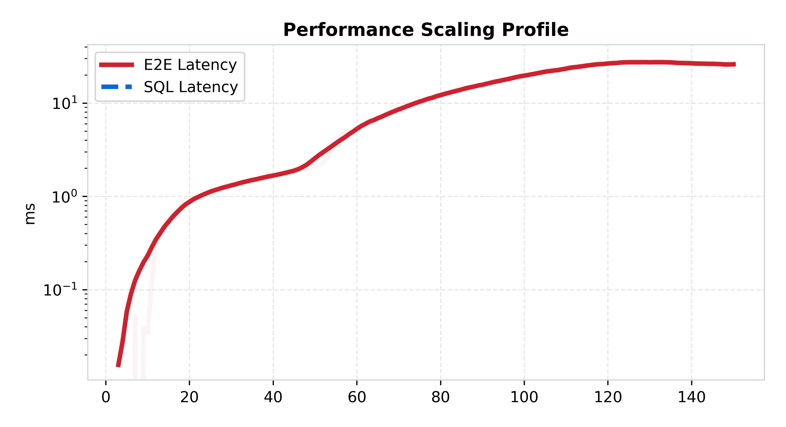
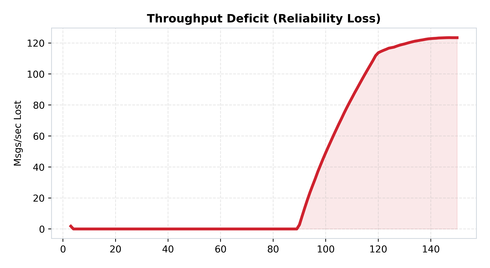

[🏠 Home](../../README.md) | [⬅️ Previous (Lab 05)](../lab-05-cloud-native-chat-infrastructure/README.md) | [Next Lab (Lab 07) ➡️](../lab-07-real-time-presence-and-delivery/README.md)

# Lab 06: Chaos and Resilience
## *Circuit Breakers, Retries, and the Dead Letter Queue*

**Purpose:** keep the system responsive when downstream processing degrades by adding explicit failure-management behavior.  
**Hypothesis:** circuit breakers, retries, and dead-letter routing will reduce cascading failures and turn unstable slowdowns into observable, recoverable states.

### 🎯 Objective
This lab makes failure a first-class design input. The goal is to prove that a distributed chat pipeline should not simply "try harder" when dependencies fail; it should fail in controlled, instrumented, and recoverable ways.

### 🔁 What Changed From Previous Lab
- Lab 05 decoupled ingest from processing, but backlog could still grow uncontrollably if the worker degraded.
- Lab 06 adds circuit-breaker logic, retry policies, and dead-letter handling.
- Messages can now be diverted instead of blindly retried forever.
- Reliability becomes part of the architecture, not just a benchmark outcome.

### 🔬 The Hypothesis
> "By implementing Circuit Breakers and Retry Policies with exponential backoff, we can prevent 'Cascading Failures.' The system will detect downstream service degradation and proactively shed load, ensuring the 'Core API' remains responsive even when the 'Persistence Worker' is failing."

### 🔴 The Problem: The Cascading Failure
In Lab 05, if the Worker was slow, the Redis Queue filled up. 
- **The Limit**: Eventually, the Queue hits the memory limit, and the API crashes. One bad component kills the whole system.
- **The Solution**: **Active Resilience**. The API monitors the health of the Worker. If the Worker fails too many times, the **Circuit Breaker trips (opens)**. The API stops sending to the failing service and instead routes to a **Dead Letter Queue (DLQ)**.

---

### 🏗️ Architecture

*Figure 1: The Resilient Mesh. API -> [Circuit Breaker] -> Worker -> [Dead Letter Queue].*

### 🏛️ System Architecture (Structured View)
```text
Client
  -> API
     -> circuit breaker decision
     -> normal queue path or dead-letter path
  -> worker
     -> retries with backoff
     -> recovery when dependency health returns
```

### 🔄 Request Flow
1. The client sends a message to the API.
2. The API checks whether the downstream path is healthy enough to accept work.
3. If the breaker is closed, the message follows the normal queue and worker path.
4. If the breaker is open, the system fails fast or diverts the message to a safer holding path.
5. Retries and replay happen only under controlled recovery conditions.

---

### 📊 Performance Analysis

*Figure 2: Performance mesh under "Chaos" conditions (simulated worker failures).*

#### 🧐 Reading the Signal:
1.  **Latency Stabilization**: Notice the sharp "Spikes" in the Latency graph. These are the moments the Circuit Breaker is "Testing" the connection.
2.  **The Trip Proof**:
   
   *Figure 3: Latency Profile. Note the "Plateau"—when the breaker is OPEN, latency is extremely low (fast-fail). When it is CLOSED, latency is higher as it attempts to process.*

---

### 📉 Reliability Audit

*Figure 4: Throughput Deficit showing "Self-Healing."*

#### 🧐 Reading the Signal:
- **DLQ Absorption**: The red area in Figure 4 is no longer "Lost Data." It represents messages that were successfully diverted to the **Dead Letter Queue**. Once the "Chaos" subsided and the worker recovered, these messages were automatically re-processed.

### 🧪 Benchmark Notes
- Benchmark README: [benchmark/README.md](./benchmark/README.md)
- Main benchmark scenario: `resilience_stress`
- Direct run command:
```bash
python3 labs/lab-06-chaos-and-resilience/benchmark/run.py --scenario resilience_stress
```

### 🧾 Interpretation
Performance changes here because the system is now choosing how to fail. Some latency drops are actually fast-fail behavior, not improvement; some throughput gaps represent deliberate diversion rather than silent loss. That distinction is the whole point of the lab.

### 🚧 Limitations
- Resilience logic adds operational complexity and more states to understand.
- A DLQ protects data, but it also creates replay and reconciliation work later.
- Circuit-breaker tuning is workload-sensitive and easy to misconfigure.

---

### 🔬 Key Lessons
- **Fast-Fail is Better than Slow-Hang**: Users prefer an "Error" to a "Loading Spinner" that never ends.
- **Observability is Resilience**: Without metrics showing the Breaker status, you are flying blind in a distributed storm.

### ✅ What This Enables For Next Lab
Lab 06 makes failure survivable, but it still focuses on messages as the main unit of work. Lab 07 adds high-frequency ephemeral state like presence and typing signals, which create a very different scaling pattern.

---

### 🚀 Commands
```bash
# Start the lab with simulated chaos
docker-compose up --build -d

# Run local benchmark
python3 labs/lab-06-chaos-and-resilience/benchmark/run.py
```

---
[Next Lab: Lab 07 (Real-Time Presence) ➡️](../lab-07-real-time-presence-and-delivery/README.md)
