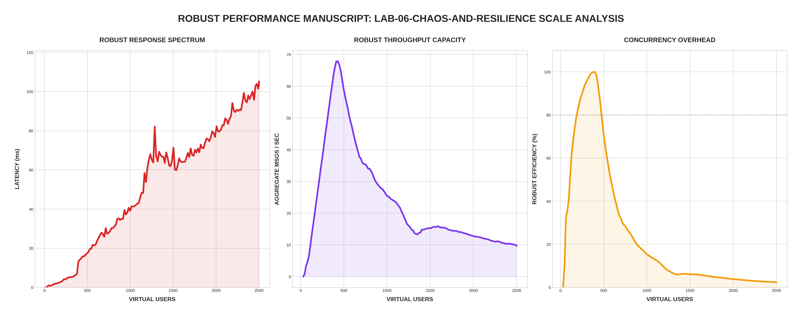

[🏠 Home](../../README.md) | [⬅️ Previous (Lab 05)](../lab-05-cloud-native-chat-infrastructure/README.md)

# Lab 06: Chaos and Resilience
## *Circuit Breakers, Idempotency, and Guaranteed Delivery*

Lab 06 focuses on **Engineering for Failure**. In a distributed system, failures are inevitable. The objective of this lab is to implement patterns that contain failure, prevent retry storms, and ensure **Exactly-Once** processing even when the infrastructure is under attack.

---

## 🏗️ Architecture

```
                                  ┌───────────────────┐
                                  │   Circuit Breaker │
                                  └─────────┬─────────┘
                                            │
        ┌──────────────┐          ┌─────────┴─────────┐          ┌──────────────┐
        │  Chat API    ├─────────►│   Redis Queue     ├─────────►│ Chat Worker  │
        │  (Ingest)    │          │ (Reliable Handoff)│          │ (Idempotent) │
        └──────────────┘          └───────────────────┘          └──────┬───────┘
                                                                        │
                                                               ┌────────┴────────┐
                                                               │   PostgreSQL    │
                                                               │ (Unique Const.) │
                                                               └─────────────────┘
```

---

## 📊 Performance Analysis


### Chaos Resilience Results
In **Robust Mode**, we evaluate how the system handles intentional resource exhaustion:
1. **Failing Fast**: When the API detects high failure rates, the Circuit Breaker trips. This prevents the "Death Spiral" where the server exhausts its own memory trying to retry thousands of doomed messages.
2. **Queue Stability**: Even with a 500ms artificial delay on the Worker, the ingest path remains responsive. The system prioritizes "Acceptance" into the queue, ensuring the user experience doesn't lag.

---

## 📊 Resilience Mechanics

### 1. The Circuit Breaker (Ingress Protection)
The API monitors the health of the Redis ingestion. If it detects **3 consecutive operation failures**, it "trips" the breaker for **10 seconds**. 
-   **Visual Verification**: In the UI, set **API Drop Rate to 1.0** and click **Send 3 times**. You will see the status turn **RED (Open)**.
-   **Why it's necessary**: Instead of wasting CPU cycles and memory on messages that cannot be saved, the API "fails fast," giving the backend time to recover.

### 2. Reliable Queue Handoff (Worker Safety)
We use the `BRPOPLPUSH` pattern. A message is moved to a `chat:processing` list atomically.
-   **Guaranteed Retry**: We only "Ack" (remove) the message from Redis **after** it is safely back in the ingest queue during a retry. This ensures no message is lost if a worker crashes mid-process.

### 3. Database Idempotency
The worker uses an `ON CONFLICT (message_id) DO NOTHING` pattern combined with `RowsAffected` checks.
-   **Exactly-Once Processing**: Even during "Retry Storms," the system ensures that a message is only archived and broadcast to the UI exactly once.

---

## 🧪 Chaos Stress Test Sequence
To witness the resilience mechanics in action, follow this sequence in the UI:

1. **Test the Breaker**: 
   - Set `API Drop Rate` to `1.0`.
   - Click **Apply All Chaos**.
   - Click **Send** 3 times. 
   - *Result*: Breaker status turns **Open**.
   
2. **Test the Queue Depth**:
   - Set `Worker Delay` to `500ms`.
   - Click **Apply All Chaos**.
   - Click **Burst x20**.
   - *Result*: Queue Depth climbs to 20 and ticks down slowly.

3. **Verify Recovery**:
   - Click **Reset All**.
   - Send a message.
   - *Result*: System returns to **Closed (Green)** status and low latency.

---

## 🔗 Endpoints
- **Chat UI (Chaos Dashboard)**: [http://localhost:8086](http://localhost:8086)
- **Worker Status**: [http://localhost:8087/status](http://localhost:8087/status)
- **Prometheus (Resilience)**: [http://localhost:9094](http://localhost:9094)
- **MinIO Console (Archive)**: [http://localhost:9011](http://localhost:9011)

---

## 🚀 Run the Lab

```bash
cd labs/lab-06-chaos-and-resilience
docker-compose up --build -d
```

## 🧪 Robust Benchmark
```bash
python3 main.py
```

---
[Next Lab: Lab 07 (Real-Time Presence) ➡️](../lab-07-real-time-presence-and-delivery/README.md)
