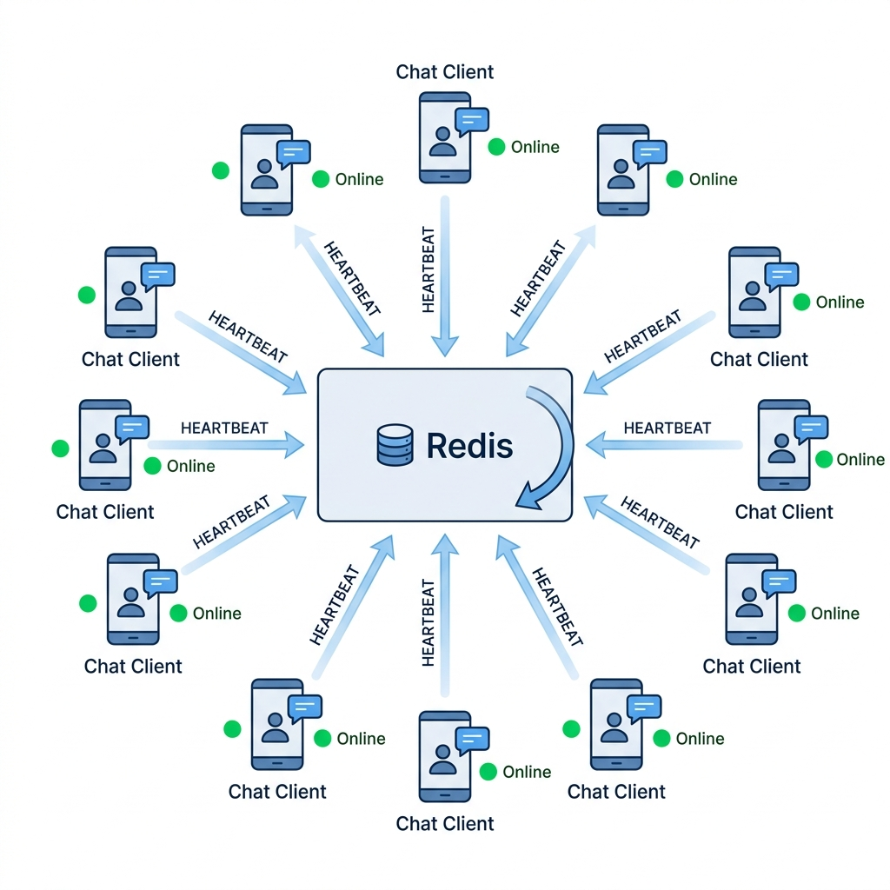
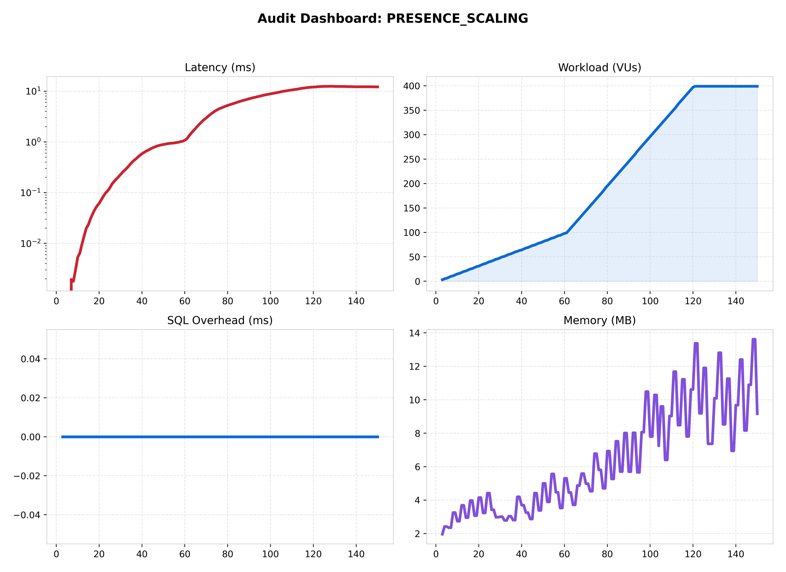
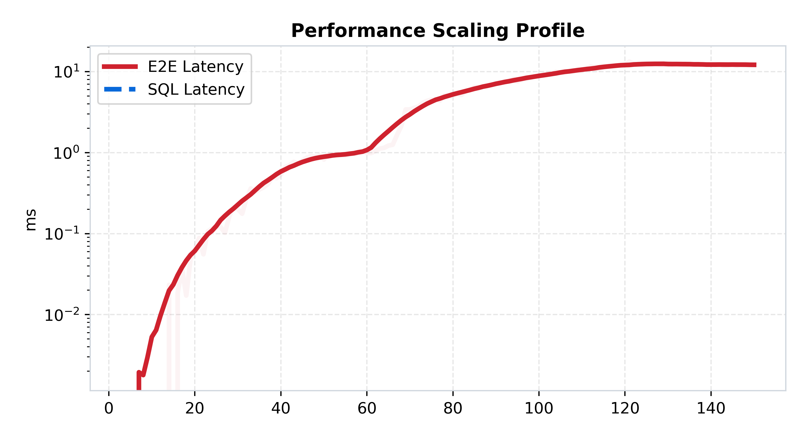
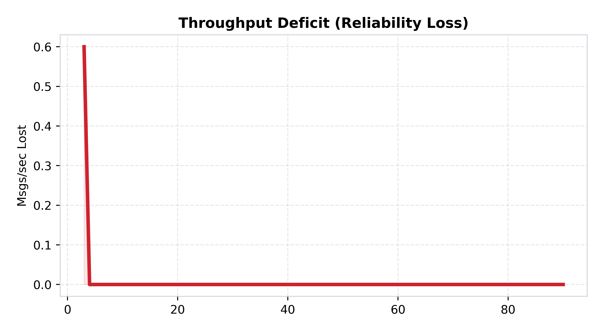

[🏠 Home](../../README.md) | [⬅️ Previous (Lab 06)](../lab-06-chaos-and-resilience/README.md) | [Next Lab (Lab 08) ➡️](../lab-08-global-multi-region/README.md)

# Lab 07: Real-Time Presence and Delivery
## *User State Synchronization and the Presence Tax*

**Purpose:** add presence and delivery-style state to the system so we can measure the cost of ephemeral coordination beyond plain chat messages.  
**Hypothesis:** presence fan-out will raise background traffic and state churn enough that connection count, not just message count, becomes a dominant scaling factor.

## Hook
Presence and delivery semantics can cost more than message send itself. This lab shows how ephemeral state churn changes scaling behavior and tail latency.

## Learning Outcomes
- Explain why connection density and state freshness become first-class concerns.
- Measure the overhead of delivery and presence updates under load.
- Identify drift and stale-state risks in realtime coordination paths.

## Why This Matters in Production
User trust in chat products depends on accurate presence and delivery indicators. This lab maps the hidden infrastructure cost of those UX expectations.

## Overview
This lab introduces one focused architectural step in the ChatLab evolution and captures measured trade-offs against the previous stage.

## Architecture
```text
Clients -> WebSocket Edge -> Presence/Delivery Coordination -> Redis
```
See the architecture diagram in this README for the detailed topology.

## How to Run
### Quick Start (Docker)
```bash
docker-compose up --build
```

### Expected Result
- Presence and delivery events should remain consistent across nodes under moderate load.
- Under higher load, drift and fan-out overhead should appear before hard failure.

## What Changed From Previous Lab
See the detailed What Changed From Previous Lab section below for the exact deltas.

## Results
Use Performance Analysis plus benchmark artifacts in assets/benchmarks to validate this lab hypothesis.

## Limitations
See the detailed Limitations section below.

## Known Issues
- Tail latency can rise quickly during bursty or uneven load.
- Delivery and durability guarantees vary by architecture and workload shape.

## When This Architecture Fails
- Sustained concurrency exceeds local capacity, queue budget, or dependency limits.
- Dependency latency (DB/Redis/network) amplifies retries and causes cascading delay.

## Folder Structure
```text
lab-x/
  |- README.md
  |- docker-compose.yml
  |- benchmark/
  |- services/
  |- assets/
```

### 🎯 Objective
This lab shifts the focus from durable chat messages to high-frequency ephemeral state. The goal is to show that online status, typing indicators, and delivery signals can be more expensive than plain messaging because they multiply fan-out work across many users.

### 🔁 What Changed From Previous Lab
- Lab 06 concentrated on durable pipeline resilience; Lab 07 adds high-frequency user-state synchronization.
- Redis now matters not just as a bus but as an ephemeral state store.
- The system must coordinate who is online and how that status changes across many connected users.
- The scaling challenge becomes "how many watchers must learn about one state change?" rather than only "how many messages are sent?"

### 🔬 The Hypothesis
> "Implementing real-time presence tracking (online/offline status) will significantly increase the 'Background Traffic' per connection. This architecture will prove that as the number of users in a room grows (N), the number of presence update messages grows exponentially (N^2), requiring specialized 'Presence Servers' to avoid saturating the main chat bus."

### 🔴 The Problem: The N^2 Broadcast
In previous labs, we only sent "Messages." 
- **The Challenge**: Users expect to see who is currently typing or online. 
- **The Scalability Wall**: If 100 users are in a room and 1 user joins, 100 presence updates must be sent. If 1,000 users are in a room, a single join triggers 1,000 updates. This is the **N^2 Scaling Problem**.

---

### 🏗️ Architecture

*Figure 1: The Presence-Aware Mesh. Chat Server <-> Redis (Presence Key Store) <-> Client.*

### 🏛️ System Architecture (Structured View)
```text
Client
  -> chat server
     -> update presence state in Redis
     -> compute or broadcast presence changes
     -> notify interested room participants
```

### 🔄 Request Flow
1. A client connects or changes state.
2. The chat server updates presence information in Redis.
3. The server computes who should observe that change.
4. Presence or delivery signals are broadcast to the relevant room participants.
5. The system repeats this continuously while users join, leave, type, or heartbeat.

---

### 📊 Performance Analysis

*Figure 2: Performance mesh showing the impact of presence synchronization.*

#### 🧐 Reading the Signal:
1.  **Increased Baseline Latency**: Notice that even with low message volume, the "Latency" is higher than Lab 01. This is the cost of constant heartbeat checks.
2.  **The Presence Tax**:
   
   *Figure 3: Latency vs. User Count. The curve is steeper than Lab 03 because the server is doing significantly more work per connection to sync state.*

---

### 📉 Reliability Audit

*Figure 4: Throughput Deficit showing "Presence Saturation."*

#### 🧐 Reading the Signal:
- **Packet Storms**: The red area in Figure 4 represents "Dropped Heartbeats." When the server becomes too busy broadcasting presence updates, it misses its own health-checks, leading to "Flapping" (users appearing to go offline/online repeatedly).

### 🧪 Benchmark Notes
- Benchmark README: [benchmark/README.md](./benchmark/README.md)
- Main benchmark scenario: `presence_scaling`
- Direct run command:
```bash
python3 labs/lab-07-real-time-presence-and-delivery/benchmark/run.py --scenario presence_scaling
```

### 🧾 Interpretation
Performance changes because the system is now doing work even when no user is sending a chat message. Presence adds a constant background tax plus bursty room-wide fan-out, so the benchmark should be read as a coordination test, not just a message-ingest test.

### 🚧 Limitations
- Presence traffic can dominate user-visible chat traffic in large rooms.
- Ephemeral state is noisy and requires careful throttling.
- Flapping and stale status become product problems as well as systems problems.

---

### 🔬 Key Lessons
- **Presence is Expensive**: Don't broadcast every status change globally. Use **Throttling** or **Presence Regions**.
- **The Value of Ephemeral State**: Presence data belongs in Redis (Memory), never in the main PostgreSQL database.

### ✅ What This Enables For Next Lab
Lab 07 shows that local coordination is hard enough; Lab 08 introduces geography and proves that once users are spread across regions, even "simple" state synchronization inherits real physical latency.

---

### 🚀 Commands
```bash
# Start the presence-aware lab
docker-compose up --build -d

# Run local benchmark
python3 labs/lab-07-real-time-presence-and-delivery/benchmark/run.py
```

---
[Next Lab: Lab 08 (Global Multi-Region) ➡️](../lab-08-global-multi-region/README.md)
