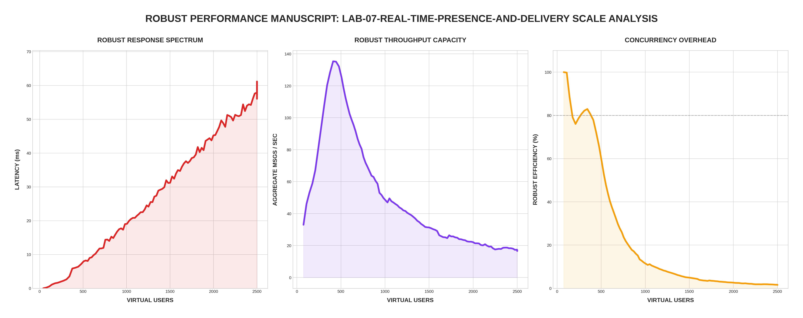

[🏠 Home](../../README.md) | [⬅️ Previous (Lab 06)](../lab-06-chaos-and-resilience/README.md)

# Lab 07: Real-Time Presence and Delivery
## *Presence Sync, Typing Signals, and Read Receipts*

Lab 07 introduces the "Social" layer of real-time applications. Beyond simple message passing, the system now manages **Presence** (Online/Offline), **Typing Indicators**, and **Message Lifecycle** (Sent ➡️ Delivered ➡️ Read).

---

## 🏗️ Architecture

```
                      ┌──────────────────────┐
                      │  WebSocket Clients   │
                      └──────────┬───────────┘
                                 │
                 ┌───────────────┴───────────────┐
        ┌────────▼────────┐             ┌────────▼────────┐
        │  Chat Node 01   │             │  Chat Node 02   │
        │ (Presence Mgmt) │             │ (Presence Mgmt) │
        └────────┬────────┘             └────────┬────────┘
                 │                               │
                 └───────────────┬───────────────┘
                                 ▼
                        ┌────────────────┐
                        │  Redis PubSub  │
                        │ (Presence Bus) │
                        └────────────────┘
```

---

## 📊 Performance Analysis


### The "Presence Penalty"
Lab 07 introduces a new category of traffic: **High-Frequency Ephemeral Events.**

1. **Typing Storms**: In this lab, we observe that even if message throughput stays stable, the CPU usage per connection increases. This is because every typing heartbeat (sent every 1-2s) must be broadcast to all other users in the room.
2. **Efficiency Cliff**: During the **Robust Mode** test (2,500 VUs), Lab 07 shows higher jitter than Lab 05. This is due to the "Broadcast Amplification" effect: 1 typing event ➡️ 1,000 broadcasts.

### Protocol Compatibility
To support both legacy benchmarks and modern social features, the Lab 07 server implements a **Type Inference Engine**:
- **Legacy Messages**: If the `type` field is missing, it defaults to `"message"`.
- **Presence Events**: JSON must include `"type": "presence"` and `"status": "online/offline"`.
- **Typing Signals**: JSON must include `"type": "typing"`.

---

## 🔗 Endpoints
- **Chat UI (Node 01)**: [http://localhost:8088](http://localhost:8088)
- **Chat UI (Node 02)**: [http://localhost:8089](http://localhost:8089)
- **Prometheus (Regional)**: [http://localhost:9095](http://localhost:9095)

---

## 🚀 Run the Lab

```bash
cd labs/lab-07-real-time-presence-and-delivery
docker-compose up --build -d
```

## 🧪 Robust Benchmark
```bash
python3 main.py
```

---
[Next Lab: Lab 09 (Message Security) ➡️](../lab-09-message-security/README.md)
