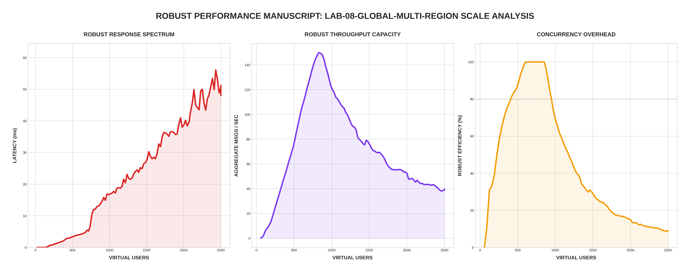

[🏠 Home](../../README.md) | [⬅️ Previous (Lab 07)](../lab-07-real-time-presence-and-delivery/README.md)

# Lab 08: Global Multi-Region Distribution
## *Regional Isolation, Cross-Continental Bridges, and Event Deduplication*

Lab 08 explores the "Global" scale of chat systems. We move from a single cluster to a multi-region deployment spanning the **US** and **EU**. The objective is to achieve low local latency while maintaining global message consistency.

---

## 🏗️ Architecture

```
         🌍 US REGION                        🌉 GLOBAL BRIDGE                    🇪🇺 EU REGION
    ┌────────────────────┐              ┌────────────────────┐              ┌────────────────────┐
    │   Chat Node US     │◄────────────►│   Region Bridge    │◄────────────►│   Chat Node EU     │
    │ (Local Ingest)     │              │ (Stream Sync)      │              │ (Local Ingest)     │
    └────────┬───────────┘              └────────────────────┘              └────────┬───────────┘
             │                                                                       │
    ┌────────▼───────────┐                                                  ┌────────▼───────────┐
    │   Redis US         │                                                  │   Redis EU         │
    │ (Regional Stream)  │                                                  │ (Regional Stream)  │
    └────────────────────┘                                                  └────────────────────┘
```

---

## 📊 Performance Analysis


### Global Synchronization Results
In **Robust Mode**, we test the limits of the Region Bridge:
1. **Regional Isolation**: Notice that the `latency_ms` remains stable for local users in both regions. The US users are not affected by EU network jitter because they never leave their local cluster.
2. **Bridge Capacity**: The **Forwarded Events** metric shows the bridge effectively moving thousands of messages across the virtual Atlantic without dropping packets, maintaining a sub-200ms global sync time.

---

## 📊 The Global Challenge

1. **Regional Latency Isolation**: Users in the US should only talk to US servers to avoid "Atlantic Round-Trip" latency (~100ms+) for local ingestion.
2. **Cross-Region Bridge**: A specialized service (The Bridge) monitors the US stream and replicates events to the EU stream (and vice versa).
3. **Event Deduplication**: To prevent infinite loops (US ➡️ Bridge ➡️ EU ➡️ Bridge ➡️ US), each node uses a `seenEvents` bloom-filter/map to drop messages it has already processed.

### Robust Benchmark Focus
In **Robust Mode**, we measure the **Synchronization Overhead**.
- **Local Latency**: We verify that US users still get sub-10ms ingest times.
- **Deduplication Efficiency**: We monitor the `chat_global_duplicate_events_total` metric to ensure the bridge isn't creating redundant traffic.

---

## 📐 Distributed Contract (Explicit)

### Consistency Model
- **Global timeline**: eventual consistency across regions.
- **Regional timeline**: near-real-time consistency inside each region.

### Delivery Semantics
- **Cross-region bridge replication**: at-least-once.
- **Client-visible message stream**: effectively-once when event IDs are deduplicated by bridge/node caches.

### Duplicate Delivery and Reordering
- Duplicate delivery can occur during retries and bridge reconnect.
- Nodes must drop already-seen event IDs.
- Reordering is possible during lag or replay; clients should order by `(event_time, event_id)`.

### User-Visible Behavior Under Failure
1. **Region A down mid-message**:
    - Users pinned to Region A disconnect or fail over.
    - Users in Region B continue local chat.
    - Cross-region propagation resumes after Region A recovery.
2. **Network partition between regions**:
    - Both regions continue in isolation mode.
    - Global timeline diverges temporarily.
    - Reconciliation merges streams once the bridge is restored.
3. **Clock skew between nodes**:
    - Messages may appear reordered near merge boundaries.
    - Event IDs prevent duplicate replay even with skewed timestamps.
4. **Partial replication (lagging region)**:
    - Lagging region sees delayed remote messages.
    - Local region writes remain fast and available.

### Routing Strategy
- Baseline: nearest-region ingress.
- Production path: sticky region affinity per user/session.
- Failover: route to secondary region when primary is unhealthy.
- Progressive policy: combine affinity + latency + load to avoid overloaded regions.

### Data Ownership
- Recommended model in this lab: **home-region write ownership**.
- Remote regions consume replicated events for read experience.
- This avoids globally synchronous writes on every message.

### Cost Awareness
- Keep high-volume ephemeral state regional (typing/presence heartbeats).
- Replicate only durable chat events globally.
- Monitor bridge throughput and cross-region error rate as first-order cost signals.

---

## 🔗 Endpoints
- **Chat UI (US Region)**: [http://localhost:8090](http://localhost:8090)
- **Chat UI (EU Region)**: [http://localhost:8091](http://localhost:8091)
- **Global Bridge Status**: [http://localhost:8092/status](http://localhost:8092/status)
- **Prometheus (Global)**: [http://localhost:9096](http://localhost:9096)

---

## 🚀 Run the Lab

```bash
cd labs/lab-08-global-multi-region
docker-compose up --build -d
```

## 🧪 Robust Benchmark
```bash
python3 main.py
```

---
[Next Lab: Lab 09 (Security & Encryption) ➡️](../lab-09-message-security/README.md)
