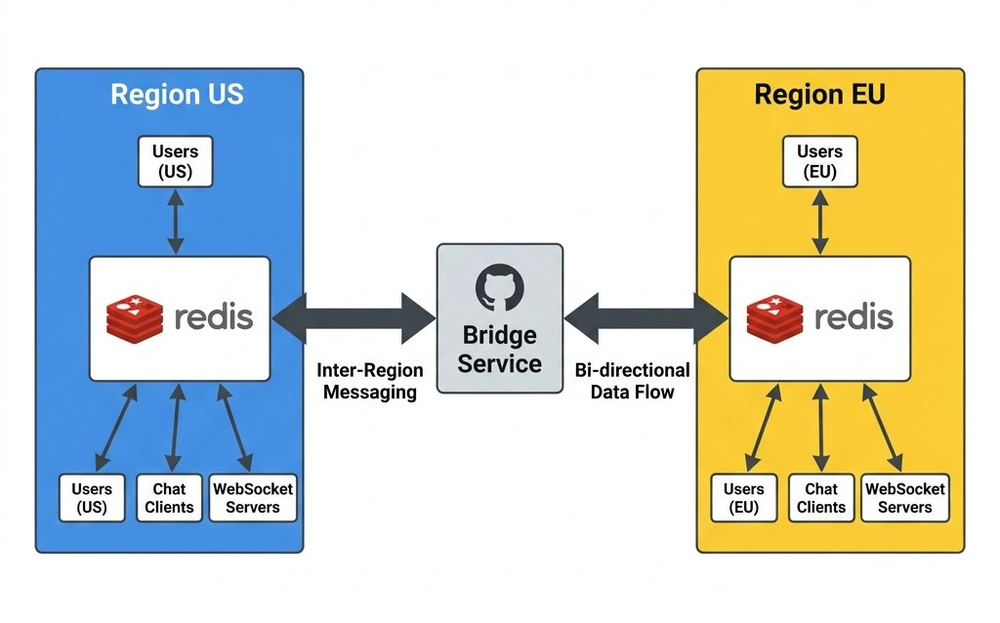
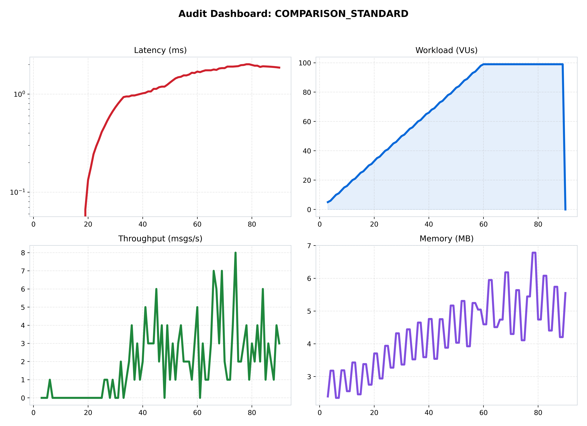
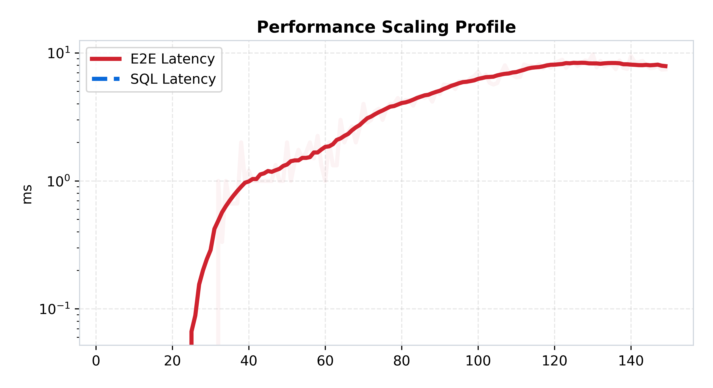
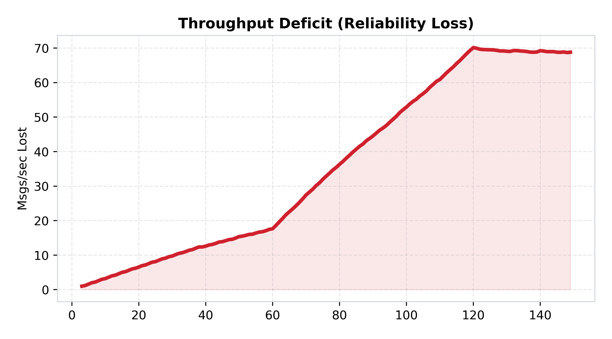

[🏠 Home](../../README.md) | [⬅️ Previous (Lab 07)](../lab-07-real-time-presence-and-delivery/README.md) | [Next Lab (Lab 09) ➡️](../lab-09-message-security/README.md)

# Lab 08: Global Multi-Region
## *Geographic Latency and the Regional Bridge*

**Purpose:** separate local user experience from global propagation by introducing regional clusters and an asynchronous bridge.  
**Hypothesis:** regional isolation will preserve fast local latency, while inter-region synchronization will expose unavoidable physical-distance costs and eventual-consistency trade-offs.

## Hook
This lab forces a real global trade-off: local low latency versus cross-region consistency. Validate where asynchronous bridging helps and where it introduces convergence delay.

## Learning Outcomes
- Explain regional affinity and asynchronous bridge replication behavior.
- Measure the impact of distance and replication lag on user experience.
- Identify where eventual consistency is acceptable and where it is not.

## Why This Matters in Production
Global chat systems cannot optimize latency and strict consistency everywhere at once. This lab gives you a concrete framework for that product-level decision.

## Overview
This lab introduces one focused architectural step in the ChatLab evolution and captures measured trade-offs against the previous stage.

## Architecture
```text
Regional Clients -> Regional Nodes -> Async Cross-Region Bridge
```
See the architecture diagram in this README for the detailed topology.

## How to Run
### Quick Start (Docker)
```bash
docker-compose up --build
```

### Expected Result
- Local-region latency should remain low while inter-region convergence is delayed but stable.
- Bridge lag should become a primary reliability and freshness signal.

## What Changed From Previous Lab
See the detailed What Changed From Previous Lab section below for the exact deltas.

## Results
Use Performance Analysis plus benchmark artifacts in assets/benchmarks to validate this lab hypothesis.

## Limitations
See the detailed Limitations section below.

## Known Issues
- Tail latency can rise quickly during bursty or uneven load.
- Delivery and durability guarantees vary by architecture and workload shape.

## When This Architecture Fails
- Sustained concurrency exceeds local capacity, queue budget, or dependency limits.
- Dependency latency (DB/Redis/network) amplifies retries and causes cascading delay.

## Folder Structure
```text
lab-x/
  |- README.md
  |- docker-compose.yml
  |- benchmark/
  |- services/
  |- assets/
```

### 🎯 Objective
This lab makes geography part of the system model. The goal is to show that once users span regions, the architecture must distinguish between local responsiveness and global convergence instead of pretending one synchronous path can satisfy both.

### 🔁 What Changed From Previous Lab
- Lab 07 focused on coordination inside one deployment boundary; Lab 08 adds multiple regions.
- Users now connect to a nearby regional stack instead of one global cluster.
- A bridge service asynchronously replicates events between regional systems.
- Global consistency becomes eventual rather than immediate.

### 🔬 The Hypothesis
> "By using Regional Redis clusters and a specialized 'Global Bridge,' we can maintain sub-10ms latency for users in the same region while ensuring global delivery. This architecture will prove that cross-region latency is bounded by the speed of light, and our goal is to minimize the 'Synchronous Wait' for distant regions."

### 🔴 The Problem: The Global Latency Wall
In previous labs, all users were in one "Data Center."
- **The Reality**: A user in Europe (EU) should not wait for a server in the USA (US) to acknowledge their message.
- **The Solution**: **Regional Isolation**. Users connect to their local region. A "Bridge Service" asynchronously syncs messages between the US and EU clusters.

---

### 🏗️ Architecture

*Figure 1: The Global Mesh. US Cluster <-> Global Bridge <-> EU Cluster.*

### 🏛️ System Architecture (Structured View)
```text
Client
  -> local regional cluster
     -> local fan-out for nearby users
     -> asynchronous bridge replication
  -> remote region receives replicated events later
```

### 🔄 Request Flow
1. A user sends a message into the nearest regional cluster.
2. The local region handles the fast local broadcast path.
3. The bridge service captures the event for remote replication.
4. Remote regions ingest the bridged event asynchronously.
5. Local users see low latency first; distant users see eventual convergence.

---

### 📊 Performance Analysis

*Figure 2: Performance mesh showing Regional vs. Global latency distribution.*

#### 🧐 Reading the Signal:
1.  **The Regional Speed Trap**: Notice the "Local" latency is extremely low. This proves our regional clusters are working independently.
2.  **The Bridge Bottleneck**:
   
   *Figure 3: Global Latency Profile. You will see a distinct "Step" in latency (~150ms+). This is the simulated physical distance between the US and EU.*

---

### 📉 Reliability Audit

*Figure 4: Throughput Deficit showing "Bridge Saturation."*

#### 🧐 Reading the Signal:
- **Asynchronous Lag**: The deficit in Figure 4 represents the **Sync Lag**. If the bridge cannot keep up with the global message volume, users in the EU will see US messages with a delay. The red area shows where the bridge buffer is beginning to overflow.

### 🧪 Benchmark Notes
- Benchmark README: [benchmark/README.md](./benchmark/README.md)
- Main benchmark scenario: `global_scaling`
- Direct run command:
```bash
python3 labs/lab-08-global-multi-region/benchmark/run.py --scenario global_scaling
```

### 🧾 Interpretation
Performance changes here because one system is now serving two very different promises: low local latency and eventual remote visibility. The benchmark matters most when it shows how well the architecture keeps those two paths separate.

### 🚧 Limitations
- Global ordering is harder than regional ordering.
- Bridge lag can accumulate under sustained inter-region load.
- Cost and bandwidth become architectural constraints, not just performance details.

---

### 🔬 Key Lessons
- **Speed of Light is the Hardest Constraint**: You can scale CPU, but you can't scale the speed of a fiber optic cable across the Atlantic.
- **Eventual Consistency is Mandatory**: At a global scale, synchronous writes are impossible. You must embrace asynchronous delivery.

### ✅ What This Enables For Next Lab
Lab 08 makes the system global, but the data is still only as trustworthy as its confidentiality model. Lab 09 adds message security and shows how encryption changes the cost profile of the mesh.

---

### 🚀 Commands
```bash
# Start the global multi-region stack
docker-compose up --build -d

# Run local benchmark
python3 labs/lab-08-global-multi-region/benchmark/run.py
```

---
[Next Lab: Lab 09 (Message Security) ➡️](../lab-09-message-security/README.md)
