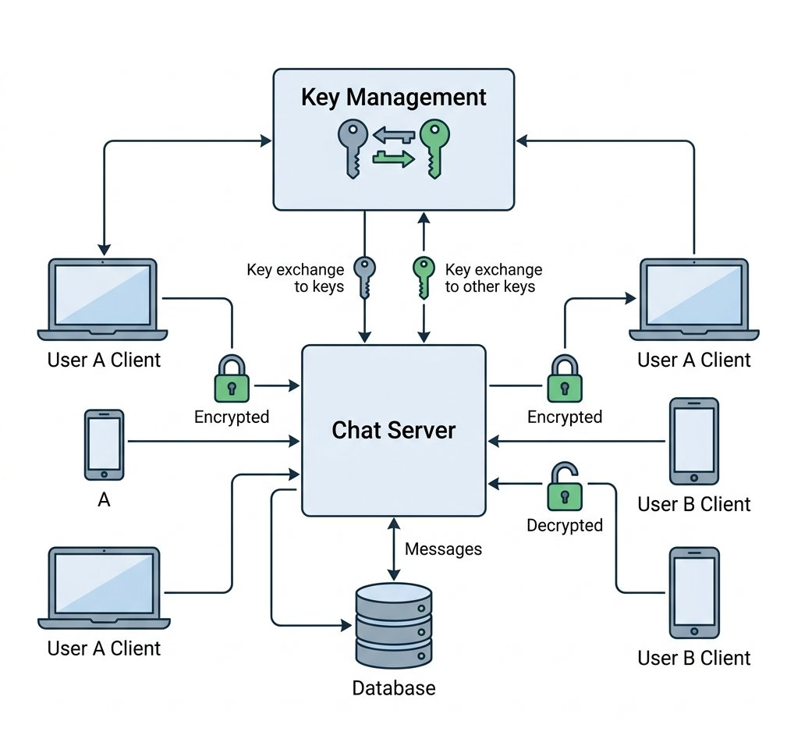
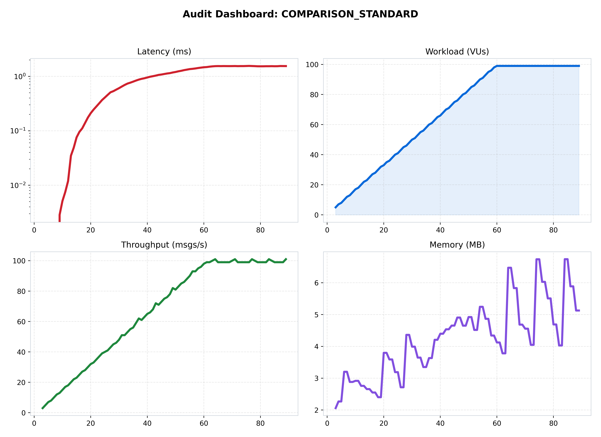
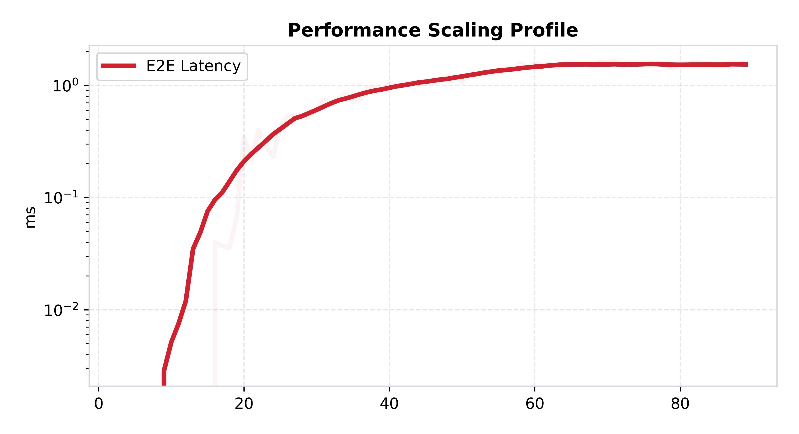
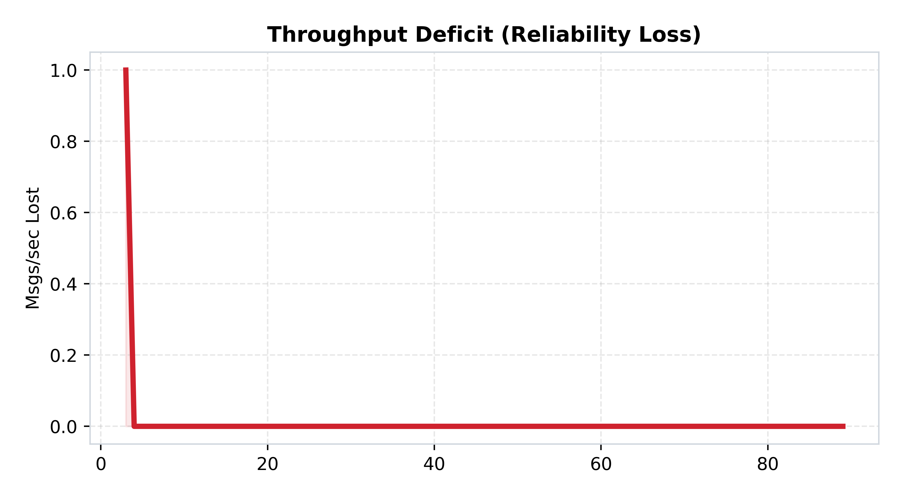

[🏠 Home](../../README.md) | [⬅️ Previous (Lab 08)](../lab-08-global-multi-region/README.md) | [Next Lab (Lab 10) ➡️](../lab-10-microservices-migration/README.md)

# Lab 09: Message Security
## *E2EE, Key Rotation, and the Security Tax*

**Purpose:** protect message confidentiality across the distributed system by adding encryption and key-management behavior.  
**Hypothesis:** stronger security will consume real CPU and coordination budget, producing a measurable security tax in latency and throughput.

## Overview
This lab introduces one focused architectural step in the ChatLab evolution and captures measured trade-offs against the previous stage.

## Architecture
```text
Client -> Ingress -> Chat Service -> State or Queue Layer
```

## How to Run
### Quick Start (Docker)
```bash
docker-compose up --build
```

## What Changed From Previous Lab
See the What Changed From Previous Lab section below for the delta from the prior lab.

## Results
See Performance Analysis plus benchmark artifacts in assets/benchmarks.

## Limitations
See the Limitations section below.

## Known Issues
- Tail latency can rise quickly during bursty load.
- Delivery and durability guarantees depend on this lab architecture.

## When This Architecture Fails
- Sustained concurrency exceeds local capacity or queue budget.
- Dependency latency (DB/Redis/network) triggers cascading delays.

## Folder Structure
```text
lab-x/
  |- README.md
  |- docker-compose.yml
  |- benchmark/
  |- services/
  |- assets/
```

### 🎯 Objective
This lab adds confidentiality as a first-class concern. The goal is to show that cryptography is not just a checkbox layered onto the transport path; it changes runtime cost, operational coordination, and the shape of performance under load.

### 🔁 What Changed From Previous Lab
- Lab 08 made the system global; Lab 09 adds encryption and key rotation on top of that distributed path.
- Messages are no longer treated as plain application payloads.
- The system must manage keys as well as messages.
- CPU and rotation overhead become part of the request cost.

### 🔬 The Hypothesis
> "Implementing End-to-End Encryption (E2EE) and frequent 'Key Rotations' will significantly increase the CPU utilization per message. This architecture will prove that while the system remains durable and distributed, the cryptographic overhead will reduce the maximum concurrent users (VUs) by >30% compared to the unsecured baseline."

### 🔴 The Problem: The Transparent Mesh
In previous labs, messages were sent in plain text.
- **The Risk**: Anyone with access to Redis or the Database can read private conversations.
- **The Solution**: **AES-GCM Encryption**. Messages are encrypted on the server (or client) using regional master keys. These keys are rotated every 10 seconds to minimize the impact of a potential breach.

---

### 🏗️ Architecture

*Figure 1: The Secure Mesh. Message -> [AES-GCM Encrypt] -> Redis -> [AES-GCM Decrypt] -> Client.*

### 🏛️ System Architecture (Structured View)
```text
Client or gateway
  -> encrypt message
  -> secure transport through the distributed mesh
  -> decrypt at the receiving side
  -> rotate keys on a recurring schedule
```

### 🔄 Request Flow
1. A message enters the secure path.
2. The system encrypts the payload with the active key material.
3. The encrypted event moves across the brokered or distributed mesh.
4. Receivers decrypt with the matching key state.
5. Key rotation periodically changes the active secrets and adds control-path work.

---

### 📊 Performance Analysis

*Figure 2: Performance mesh showing the "Security Tax" under load.*

#### 🧐 Reading the Signal:
1.  **CPU Spike**: Notice the "Memory" and "Processing" graphs are higher than Lab 03. Cryptography is a CPU-intensive operation.
2.  **The Rotation Penalty**:
   
   *Figure 3: Latency Profile. You will see recurring "Jitter" or spikes every 10 seconds. This is the **Key Rotation Window**—the moment the system generates new secrets and propagates them across the mesh.*

---

### 📉 Reliability Audit

*Figure 4: Throughput Deficit showing "Cryptographic Saturation."*

#### 🧐 Reading the Signal:
- **Throughput Decay**: The red area in Figure 4 shows where the CPU can no longer keep up with the encryption/decryption demands. The "Security Tax" has effectively lowered our system's maximum capacity.

### 🧪 Benchmark Notes
- Benchmark README: [benchmark/README.md](./benchmark/README.md)
- Main benchmark scenario: `security_overhead`
- Direct run command:
```bash
python3 labs/lab-09-message-security/benchmark/run.py --scenario security_overhead
```

### 🧾 Interpretation
Performance changes here because every message now carries cryptographic work and periodic rotation overhead. Some jitter is no longer caused by load spikes alone; it can also be caused by the control plane that keeps keys fresh and safe.

### 🚧 Limitations
- Security overhead reduces raw throughput headroom.
- Key rotation adds operational coordination cost.
- Protecting confidentiality does not automatically solve service-boundary complexity.

---

### 🔬 Key Lessons
- **Security is a Resource**: You cannot have E2EE for free. You must budget for the additional CPU cycles.
- **Rotation Frequency Trade-off**: Shorter rotation windows increase security but create more "System Jitter."

### ✅ What This Enables For Next Lab
Lab 09 secures the mesh, but the architecture is still operationally centralized in important places. Lab 10 separates responsibilities into independent services so scaling and failure domains can be managed more deliberately.

---

### 🚀 Commands
```bash
# Start the secure chat stack
docker-compose up --build -d

# Run local benchmark
python3 labs/lab-09-message-security/benchmark/run.py
```

---
[Next Lab: Lab 10 (Microservices Migration) ➡️](../lab-10-microservices-migration/README.md)
