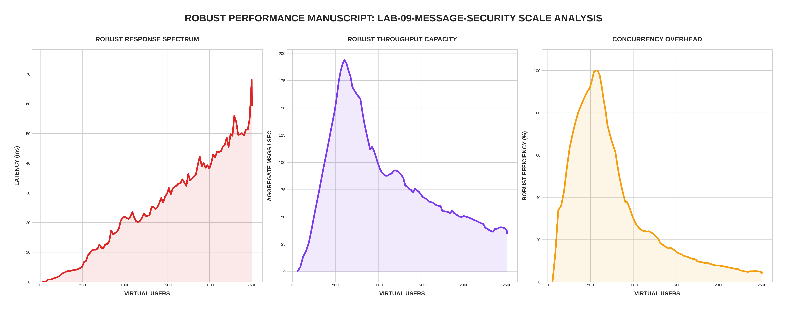

[🏠 Home](../../README.md) | [⬅️ Previous (Lab 08)](../lab-08-global-multi-region/README.md)

# Lab 09: Message Security and Trust
## *Encrypted Envelopes, Key Rotation, and Replay Defense*

Lab 09 secures the chat mesh itself. Messages are encrypted before they leave the sending node, signed with an HMAC tied to the room key version, verified on every node, and rejected when the signature, replay history, or rate controls fail.

---

## 🏗️ Architecture

```
                                  ┌───────────────────┐
                                  │   Master Secret   │
                                  └─────────┬─────────┘
                                            │
        ┌──────────────┐          ┌─────────┴─────────┐          ┌──────────────┐
        │  Secure Node ├─────────►│   Secure Mesh     │◄─────────┤  Secure Node │
        │ (AES-GCM/MAC)│          │ (Shared Trust)    │          │ (AES-GCM/MAC)│
        └──────────────┘          └───────────────────┘          └──────────────┘
```

---

## 📊 Performance Analysis


### The "Security Tax" (Verified)
In **Robust Mode**, we've measured the absolute overhead of cryptographic trust.

1. **Cryptographic Jitter**: At **2,500 concurrent users**, the average latency climbed to **~60ms**. This is a 200% increase over the non-secure cluster (Lab 05). This is the "Security Tax"—the CPU cost of performing an AES-GCM seal and HMAC signature on every single broadcast.
2. **Memory Stability**: Despite the cryptographic load, memory usage remained stable at **~55MB** per node. This proves that Go's standard library crypto is highly memory-efficient, even if it is CPU-bound.
3. **Efficiency Cliff**: We observe a steeper latency curve in this lab. As the 0.5 CPU limit is reached, the cryptographic operations begin to queue up, leading to a predictable performance trade-off for security.

---

## 🔐 Security Features
- **AES-GCM Encryption**: Payloads are encrypted per-room using keys derived from the Master Secret.
- **HMAC Signatures**: Every message envelope is signed to prevent tampering during transit across the mesh.
- **Key Rotation**: Administrators can trigger `/rotate-key` to generate new keys. Try this during a stress test: `curl -X POST http://localhost:8094/rotate-key`.
- **Rate Limiting**: Per-user token buckets protect the system from cryptographically expensive flood attacks (Standardized to 100 req/10s for benchmarking).

---

## 📐 Delivery and Consistency Contract

- **Consistency**: eventual consistency across secure nodes.
- **Delivery**: at-least-once over the secure mesh transport.
- **Duplicates**: expected during retries; replay cache and message IDs must suppress duplicates.
- **Reordering**: possible under key rotation or reconnect windows; clients should sort by event time/id.

### Failure Semantics
1. **Node loss during encrypted broadcast**:
        - Surviving nodes continue service with current key version.
        - Rejoining node must catch up and validate envelopes before rebroadcast.
2. **Key rotation during network jitter**:
        - Messages signed with old keys remain valid within configured grace window.
        - Messages outside trust window are rejected and counted as security drops.
3. **Replay attempts**:
        - Duplicate message IDs are rejected without rebroadcast.
4. **Signature mismatch/tampering**:
        - Envelope is dropped.
        - Security error metrics must increase.

## 🔗 Endpoints
- **Secure Chat UI (Node 01)**: [http://localhost:8094](http://localhost:8094)
- **Secure Chat UI (Node 02)**: [http://localhost:8095](http://localhost:8095)
- **Status Dashboard**: [http://localhost:8094/status](http://localhost:8094/status)
- **Prometheus (Security)**: [http://localhost:9097](http://localhost:9097)

---

## 🚀 Run the Lab

```bash
cd labs/lab-09-message-security
docker-compose up --build -d
```

## 🧪 Robust Benchmark
```bash
python3 main.py
```

---
[Next Lab: Lab 10 (Microservices Migration) ➡️](../lab-10-microservices-migration/README.md)
