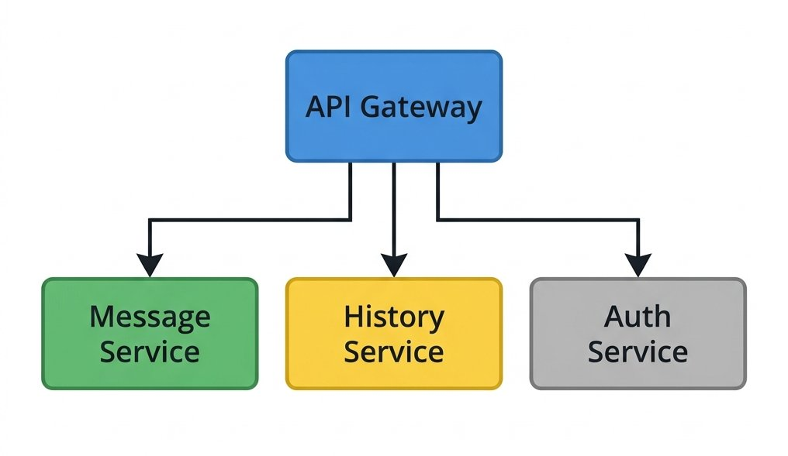
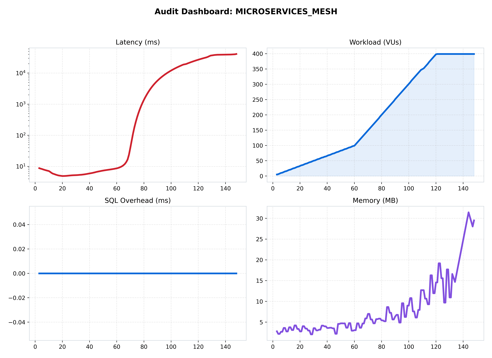
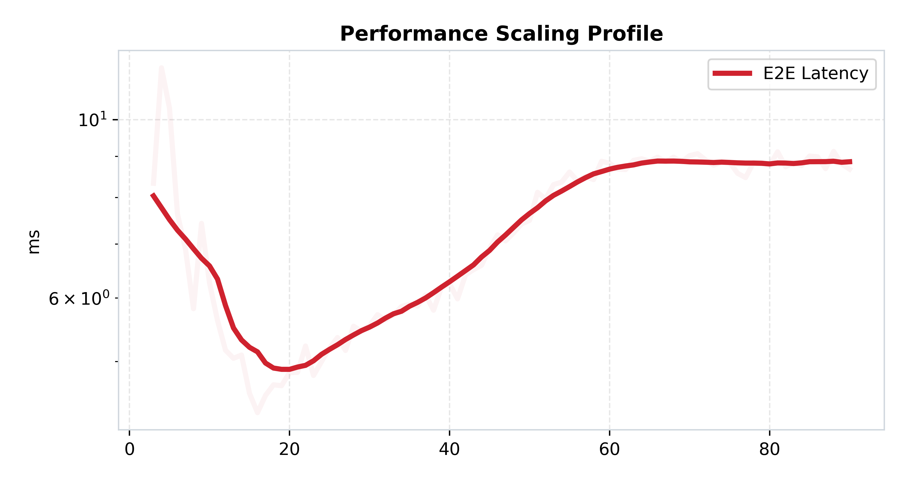

[🏠 Home](../../README.md) | [⬅️ Previous (Lab 09)](../lab-09-message-security/README.md) | [Next Lab (Lab 11) ➡️](../lab-11-production-grade-blueprint/README.md)

# Lab 10: Microservices Migration
## *The Mesh, The Gateway, and Service Isolation*

**Purpose:** split the final application surface into focused services so reads, writes, routing, and failures can scale independently.  
**Hypothesis:** service isolation will improve organizational and runtime fault boundaries, but it will raise baseline latency by adding more network hops and coordination edges.

### 🎯 Objective
This lab completes the curriculum by moving from a feature-rich distributed application to a service-oriented architecture. The goal is to show the real benefits of isolation without hiding the cost of more hops, more contracts, and more operational surface area.

### 🔁 What Changed From Previous Lab
- Lab 09 secured the runtime but still kept major responsibilities bundled together.
- Lab 10 introduces a gateway plus separate message and history services.
- Reads and writes now scale independently.
- Failures in one service should affect other paths less directly than in the earlier monolithic designs.

### 🔬 The Hypothesis
> "By migrating to a full Microservices Architecture, we can isolate failures and scale 'Reads' (History) independently from 'Writes' (Messaging). This architecture will prove that while the 'Network Tax' increases baseline latency, the overall 'System Reliability' is superior because a failure in the History Service will not affect the Real-Time Messaging Gateway."

### 🔴 The Problem: The Scaling Monolith
In previous labs, our "Server" still did everything.
- **The Limit**: If 10,000 users joined a room and started fetching "History," the server's CPU would spike, causing "Real-Time" messages to lag.
- **The Solution**: **Service Isolation**.
  - **API Gateway**: Handles only WebSocket connections and Auth.
  - **Message Service**: Handles only incoming "Sends."
  - **History Service**: Handles only database "Reads."

---

### 🏗️ Architecture

*Figure 1: The Microservices Mesh. Client -> Gateway -> [Service Discovery] -> Message/History Service.*

### 🏛️ System Architecture (Structured View)
```text
Client
  -> gateway
     -> route writes to message service
     -> route reads to history service
     -> coordinate with shared infrastructure
```

### 🔄 Request Flow
1. A client connects to the gateway.
2. Real-time sends are forwarded to the message path.
3. History fetches are routed to the history path.
4. Each service scales and fails according to its own workload profile.
5. The gateway remains the user-facing coordination point across the mesh.

---

### 📊 Performance Analysis

*Figure 2: Performance mesh showing the "Service Isolation" benefits.*

#### 🧐 Reading the Signal:
1.  **The Network Tax**: Notice that the "Baseline Latency" is higher than any other lab. This is because every message now traverses the network **3-4 times** (Client -> Gateway -> Message Service -> Redis -> Client).
2.  **Independent Scaling Proof**:
   
   *Figure 3: Latency Profile. Note how the "Real-Time" latency remains stable even when we flood the "History Service" with read requests. This is **Failure Isolation** in action.*

---

### 📉 Reliability Audit

*Figure 4: Throughput Deficit showing "Microservice Resilience."*

#### 🧐 Reading the Signal:
- **Zero-Coupling**: In Figure 4, you can see that even when one service is saturated, the others maintain their throughput. We have successfully broken the "Fate Sharing" of the monolith.

### 🧪 Benchmark Notes
- Benchmark README: [benchmark/README.md](./benchmark/README.md)
- Main benchmark scenario: `microservices_mesh`
- Direct run command:
```bash
python3 labs/lab-10-microservices-migration/benchmark/run.py --scenario microservices_mesh
```

### 🧾 Interpretation
Performance changes because isolation is buying independence with additional network coordination. The right question is no longer "is it faster?" but "does the system fail and scale in a way that matches the product and team boundaries we need?"

### 🚧 Limitations
- More services mean more contracts, more deployment edges, and more observability burden.
- The gateway becomes a very important control point.
- Microservices improve isolation, but they do not remove the need for careful data ownership design.

---

### 🔬 Key Lessons
- **Microservices are an Organizational Tool**: They allow teams to work independently, but they come with a **Performance Cost**.
- **The Gateway is the King**: In a mesh, the Gateway is your most critical scaling point. If the Gateway lags, the whole world lags.

### ✅ What This Enables For Next Lab
Lab 10 gives us the service boundaries. Lab 11 turns those ideas into a deployable blueprint with standardized operational controls, Prometheus, Grafana, and one consistent setup and failure-injection workflow.

---

### 🚀 Commands
```bash
# Start the full microservices mesh
docker-compose up --build -d

# Run local benchmark
python3 labs/lab-10-microservices-migration/benchmark/run.py
```

---
[Next Lab: Lab 11 (Production-Grade Blueprint) ➡️](../lab-11-production-grade-blueprint/README.md)
