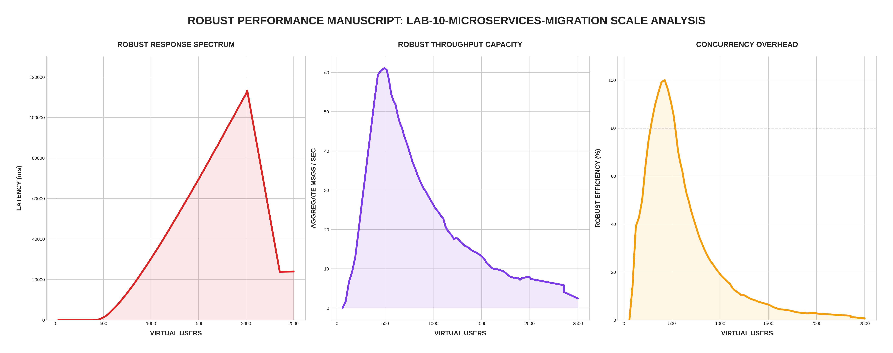

[🏠 Home](../../README.md) | [⬅️ Previous (Lab 09)](../lab-09-message-security/README.md)

# Lab 10: Microservices Migration
## *Service Isolation, API Gateway Routing, and Distributed Observability*

Lab 10 represents the pinnacle of the architecture: a fully decoupled **Microservices Mesh**. We move from a monolithic secure node to a system where ingress, writes, and reads are handled by independent services.

---

## 🏗️ Architecture

```
                                  ┌───────────────────┐
                                  │   WebSocket Client│
                                  └─────────┬─────────┘
                                            │
        ┌──────────────┐          ┌─────────┴─────────┐          ┌──────────────┐
        │ History Svc  │◄────────┤    API Gateway    ├─────────►│ Message Svc  │
        │ (Read Path)  │          │ (Routing/Auth)    │          │ (Write Path) │
        └──────────────┘          └─────────┬─────────┘          └──────────────┘
                                            │
                                  ┌─────────┴─────────┐
                                  │   Redis / Postgres│
                                  └───────────────────┘
```

---

## 📊 Performance Analysis


### The "Microservice Tax" vs. Scaling Advantage
In **Robust Mode**, we analyze the trade-offs of extreme decoupling:

1. **Network Hop Jitter**: You will notice a slight baseline latency increase compared to the monolith. This is because every message now traverses the Gateway ➡️ Message Service ➡️ Redis ➡️ Gateway hop.
2. **Specialized Scaling**: Notice that the **History Service** memory remains flat even when the **Message Service** is under heavy load. This allows us to scale the "Chat Ingest" independently of the "History Retrieval" traffic.
3. **Gateway Saturation**: The Gateway is now the primary bottleneck. By monitoring its metrics on port 8100, we can see exactly when the WebSocket connection limit is reached, independent of the backend logic.

---

## 🔬 Service Breakdown
- **API Gateway (8100)**: The single entry point. Handles WebSocket connections, enforces rate limits, and proxies requests to backend services.
- **Message Service (8101)**: Dedicated to the "Write" path. Saves to PostgreSQL and publishes to the Redis event bus.
- **History Service (8102)**: Dedicated to the "Read" path. Serves historical room messages from PostgreSQL.
- **Unified Observability**: Prometheus aggregates metrics from all three services on port 9100.

---

## 🔗 Endpoints
- **Chat UI (via Gateway)**: [http://localhost:8100](http://localhost:8100)
- **Gateway Status**: [http://localhost:8100/status](http://localhost:8100/status)
- **Message Svc Metrics**: [http://localhost:8101/metrics](http://localhost:8101/metrics)
- **Prometheus (Mesh)**: [http://localhost:9100](http://localhost:9100)

---

## 🚀 Run the Mesh

```bash
cd labs/lab-10-microservices-migration
docker-compose up --build -d
```

## 🧪 Robust Benchmark
```bash
python3 main.py
```

---
[Next Lab: Lab 11 (Serverless Integration) ➡️](../lab-11-serverless-functions/README.md)
