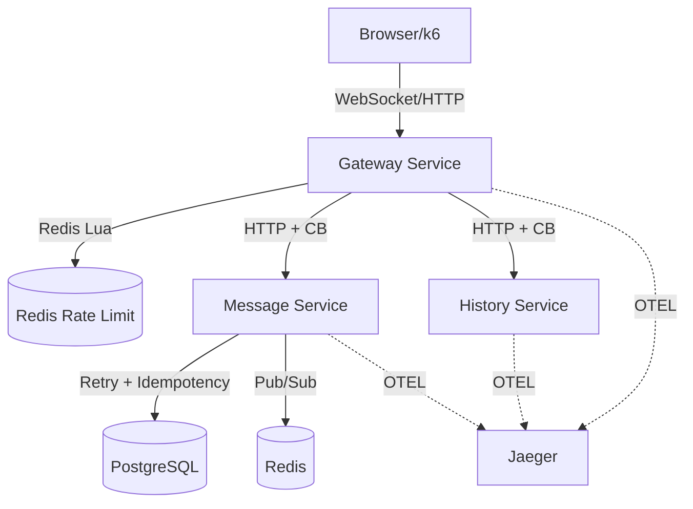
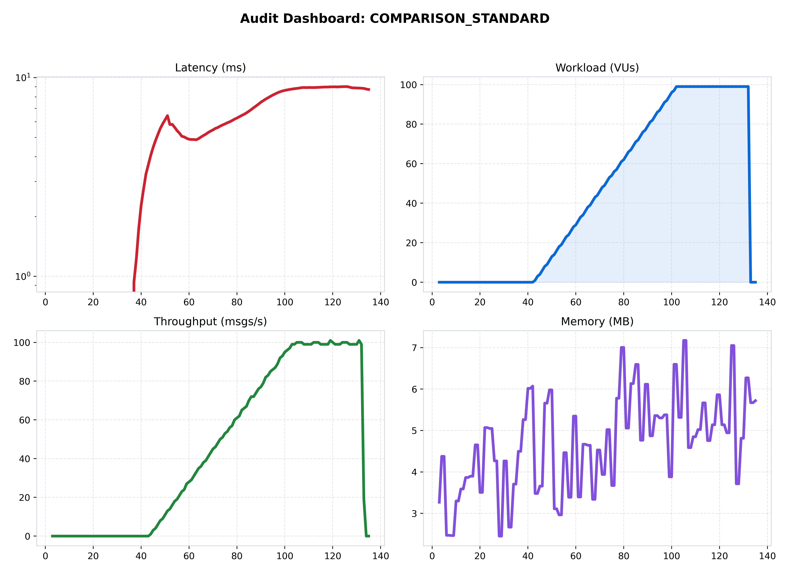

[🏠 Home](../../README.md) | [⬅️ Previous (Lab 10)](../lab-10-microservices-migration/README.md)

# Lab 11: Production-Grade Blueprint
## *Operational Guardrails, Traceability, and Failure-Aware Runtime Behavior*

**Purpose:** convert the service-split architecture from Lab 10 into an operable blueprint with explicit resilience controls, observability standards, and repeatable recovery workflows.
**Hypothesis:** adding rate limits, circuit breakers, retries, tracing, and chaos verification will improve operational safety under failure, but it will add measurable latency and throughput overhead.

## Overview
This capstone focuses on operating quality, not only feature delivery. The system is intentionally built to answer practical production questions:
- Can the platform degrade predictably when dependencies are slow or down?
- Can engineers explain latency and throughput changes quickly?
- Can retry behavior be made safe through idempotency?

## Architecture
```text
Client -> Gateway -> Message/History Services -> Redis/PostgreSQL
                       \-> OTEL traces -> Jaeger
```

## How to Run
### Quick Start (Docker)
```bash
docker-compose up --build
```

### Recommended Workflow
```bash
# Start
make up LAB=lab-11-production-grade-blueprint

# Observe endpoints (Chat UI, Grafana, Jaeger)
make observe LAB=lab-11-production-grade-blueprint

# Benchmark (normal)
make bench LAB=lab-11-production-grade-blueprint

# Benchmark with injected failure
make bench LAB=lab-11-production-grade-blueprint chaos=true

# Teardown
make down LAB=lab-11-production-grade-blueprint
```

## What Changed From Previous Lab
- Added control-plane behavior at ingress: global Redis-backed rate limiting and dependency-aware circuit breaker actions.
- Added stronger resilience defaults: jittered retry behavior and idempotent persistence semantics.
- Added distributed tracing hooks (OTEL -> Jaeger) to make cross-service latency visible.
- Added a first-class chaos benchmark path so recovery is tested, not assumed.

## Results
From the latest `comparison_standard` report in `results/comparison.md`:
- p95 latency: **9.11 ms**
- average throughput: **43.52 msgs/s**
- error rate: **0.00%**

Interpretation: this lab prioritizes controlled behavior under stress and dependency failure over raw peak throughput.

## Limitations
- More hops and more protective middleware increase baseline coordination overhead.
- Safe retries and backpressure controls can reduce throughput before hard failures occur.
- This blueprint remains a Compose-based local reference, not a full multi-cluster production deployment.

## Known Issues
- Under mixed read/write stress, gateway-level throttling can mask downstream saturation symptoms.
- Tracing and telemetry improve diagnosis but add runtime overhead and operational tuning cost.

## When This Architecture Fails
- Core dependencies remain degraded longer than circuit-breaker and retry budgets can absorb.
- Rate-limit and retry thresholds are mis-tuned relative to real traffic distribution.
- Operators do not monitor queueing and dependency latency early enough to prevent amplification.

## Folder Structure
```text
lab-11-production-grade-blueprint/
  |- README.md
  |- docker-compose.yml
  |- benchmark/
  |- services/
  |- assets/
```

### 🎯 Objective
Build a repeatable, failure-aware capstone where safety mechanisms are measurable and inspectable, not implicit.

### 🔁 Request Flow
1. Client sends message traffic to the gateway.
2. Gateway applies global rate limiting and forwards traffic through protected downstream paths.
3. Message service persists data with retry + idempotency protections.
4. History service serves read traffic independently from write-heavy paths.
5. Metrics and traces are emitted for latency, errors, saturation, and dependency behavior.
6. Chaos runs intentionally degrade service paths to validate recovery and operational response.

### 🌟 Operational Features
1. **Resilience Controls**
   - Circuit-breaker behavior at gateway boundaries.
   - Jittered retry strategy for transient dependency faults.
   - Idempotency-aware write handling to prevent duplicate side effects.
2. **Deep Observability**
   - Golden-signal dashboards for latency, traffic, errors, and saturation.
   - End-to-end traces through Jaeger via OTEL instrumentation.
3. **Safe Throughput Governance**
   - Redis-backed global rate limiting with consistent ingress policy.
   - Explicit backpressure behavior under dependency stress.

### 📐 System Architecture


### 📊 Performance Snapshot


The dashboard should be read as a control-systems view:
- latency behavior under load
- throughput stability during dependency pressure
- reliability trends when protections trigger

### 🧪 Failure Validation
Use chaos-enabled runs to validate:
- recovery behavior after dependency interruption
- whether circuit-breaker settings reduce blast radius
- whether retry configuration creates acceptable recovery, not retry storms

### ✅ Capstone Takeaways
- This lab is a blueprint for operability: predictable degradation, measurable behavior, and diagnosable incidents.
- The design intentionally trades some raw throughput for safer failure behavior and clearer operational insight.
- Production readiness is treated as a systems property, not a single service feature.
