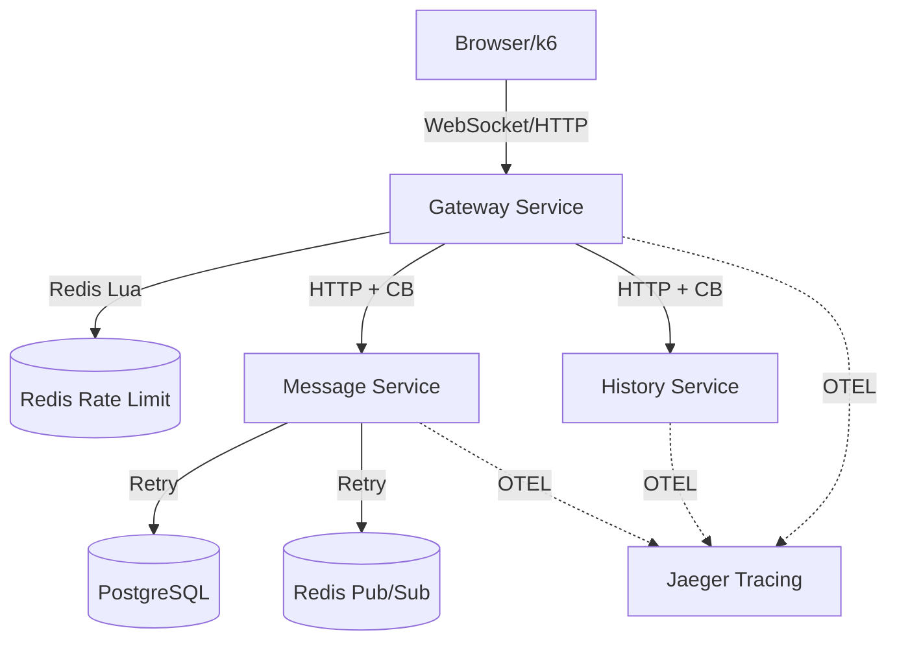

# Lab 11: Production-Grade Blueprint (Hardened)

This is the capstone of the ChatLab curriculum. It represents a system ready for real-world traffic, featuring advanced resilience, deep observability, and architectural rigor.

## 🌟 Key Features

### 1. Hardened Resilience
- **Circuit Breakers:** The Gateway automatically trips if downstream services (`message-service` or `history-service`) fail, preventing cascading failures.
- **Global Redis Rate Limiting:** Uses a Lua-scripted token bucket in Redis to enforce cross-replica rate limits.
- **Jittered Retries:** Every service uses exponential backoff with jitter for database and Redis operations to survive transient outages.

### 2. Deep Observability
- **Distributed Tracing:** Fully instrumented with **OpenTelemetry**. Every message flow is traceable from the Gateway to the Database in **Jaeger**.
- **Golden Signals:** Dashboards in Grafana track Latency, Traffic, Errors, and Saturation.

### 3. Stability & Idempotency
- **ULID Generation:** Messages use Lexicographically Sortable IDs (ULIDs) for global uniqueness and natural time-based sorting.
- **Idempotency:** The `message-service` ensures that retried requests from the gateway do not create duplicate messages.

---

## 🚀 Operations Guide

### Step 1: Start the Stack
```bash
make up LAB=lab-11-production-grade-blueprint
```

### Step 2: Observe
View the health and traces of your system:
```bash
make observe LAB=lab-11-production-grade-blueprint
```
- **Chat UI:** http://localhost:8110
- **Grafana:** http://localhost:3000
- **Jaeger:** http://localhost:16686

### Step 3: Chaos Benchmark
Prove the system's resilience by injecting failures during a load test:
```bash
make bench LAB=lab-11-production-grade-blueprint chaos=true
```

## 📐 Architecture Diagram

